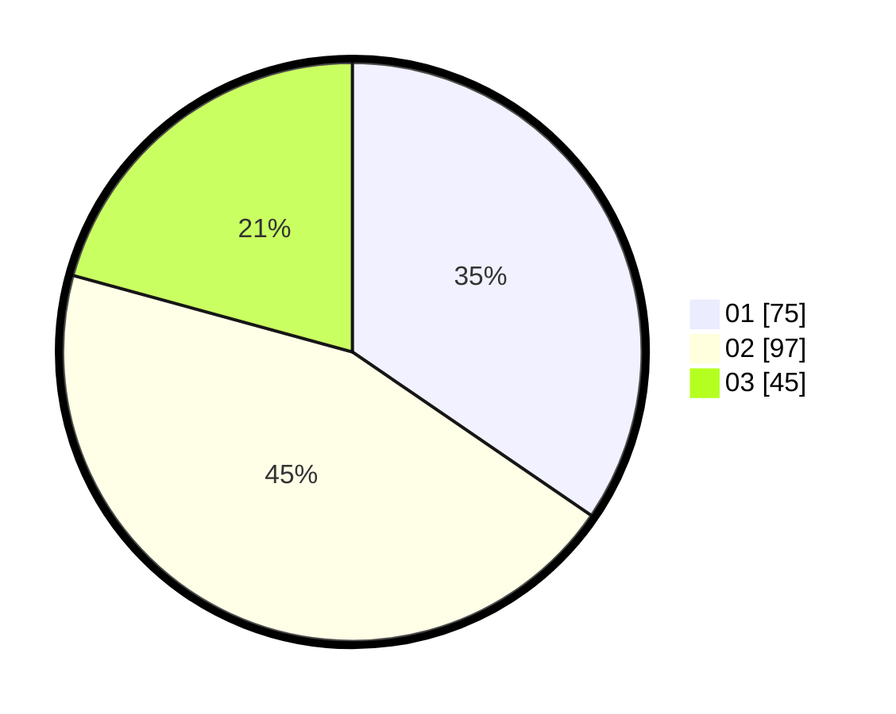

# Hasil

Hasil perolehan suara paslon dapat dilihat pada file paslon-01.txt, paslon-02.txt, dan paslon-03.txt.

Jika tidak ada, artinya data tersebut belum ada pada SIREKAP.

## Perolehan Suara

 * Paslon 01: **75**.
 * Paslon 02: **97**.
 * Paslon 03: **45**.

## Foto C Plano

https://sirekap-obj-formc.kpu.go.id/7708/pemilu/ppwp/31/73/01/10/01/3173011001052-20240214-194810--42a583f6-ae77-40c8-b41f-f9424096a628.jpg

https://sirekap-obj-formc.kpu.go.id/7708/pemilu/ppwp/31/73/01/10/01/3173011001052-20240214-225945--fdfed90d-63b0-4360-a889-bbf5fc5a660a.jpg

https://sirekap-obj-formc.kpu.go.id/7708/pemilu/ppwp/31/73/01/10/01/3173011001052-20240214-194622--a8b04b81-8037-48fa-8e59-0ac505b8f546.jpg

## DATA PEMILIH TETAP

Jumlah pemilih dalam DPT: **278**.
 * L: **146**.
 * P: **132**.

## DATA PENGGUNA HAK PILIH

Jumlah pengguna hak pilih dalam DPT: **220**.
 * L: **111**.
 * P: **109**.

Jumlah pengguna hak pilih dalam DPTb: **1**.
 * L: **0**.
 * P: **1**.

Jumlah pengguna hak pilih dalam DPK: **0**.
 * L: **0**.
 * P: **0**.

Jumlah pengguna hak pilih: **221**.
 * L: **111**.
 * P: **110**.

## JUMLAH SUARA SAH DAN TIDAK SAH

JUMLAH SELURUH SUARA SAH: **217**.

JUMLAH SUARA TIDAK SAH: **4**.

JUMLAH SELURUH SUARA SAH DAN SUARA TIDAK SAH: **221**.
