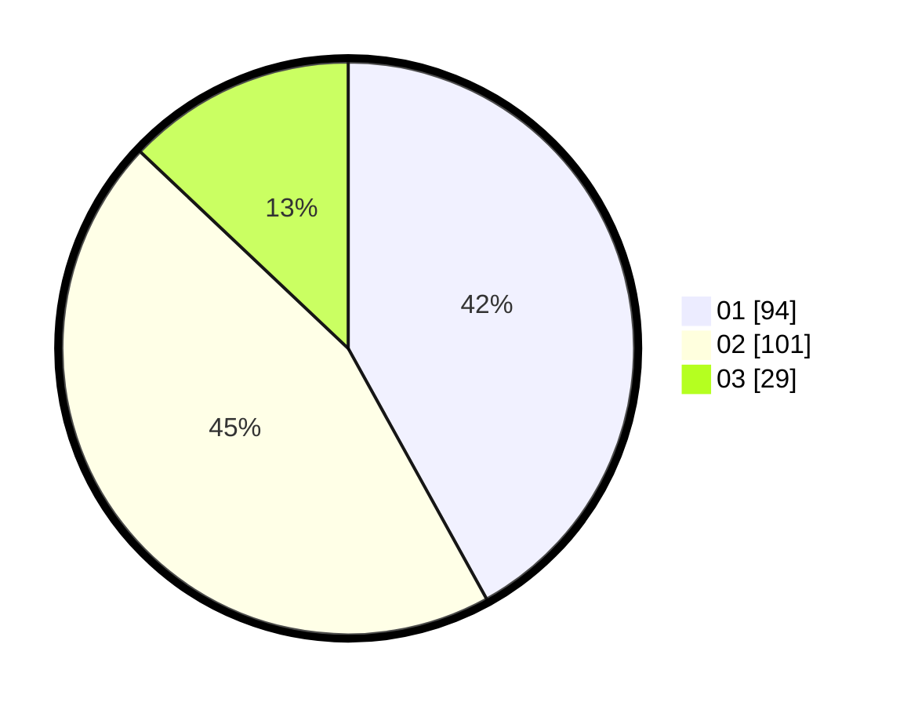

# Hasil

Hasil perolehan suara paslon dapat dilihat pada file paslon-01.txt, paslon-02.txt, dan paslon-03.txt.

Jika tidak ada, artinya data tersebut belum ada pada SIREKAP.

## Perolehan Suara

 * Paslon 01: **94**.
 * Paslon 02: **101**.
 * Paslon 03: **29**.

## Foto C Plano

https://sirekap-obj-formc.kpu.go.id/f7bc/pemilu/ppwp/31/73/01/10/01/3173011001056-20240214-230015--800af17c-db12-486a-8eb2-9a04853e3712.jpg

https://sirekap-obj-formc.kpu.go.id/f7bc/pemilu/ppwp/31/73/01/10/01/3173011001056-20240214-225939--c6ad01e2-9358-4256-bfe3-e0a7a3d30e93.jpg

https://sirekap-obj-formc.kpu.go.id/f7bc/pemilu/ppwp/31/73/01/10/01/3173011001056-20240214-225832--e1b2e521-471b-4920-8b84-9b3e01b2b02d.jpg
