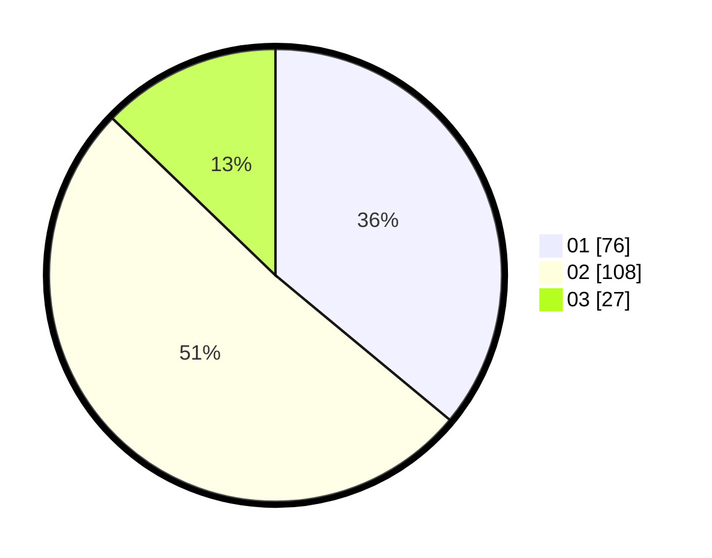

# Hasil

Hasil perolehan suara paslon dapat dilihat pada file paslon-01.txt, paslon-02.txt, dan paslon-03.txt.

Jika tidak ada, artinya data tersebut belum ada pada SIREKAP.

## Perolehan Suara

 * Paslon 01: **76**.
 * Paslon 02: **108**.
 * Paslon 03: **27**.

## Foto C Plano

https://sirekap-obj-formc.kpu.go.id/4b60/pemilu/ppwp/31/73/01/10/01/3173011001060-20240215-020142--0b6fd964-e197-445f-9664-a5e4d1a0b095.jpg

https://sirekap-obj-formc.kpu.go.id/4b60/pemilu/ppwp/31/73/01/10/01/3173011001060-20240215-020333--42701380-dcf8-4fe3-9593-cca8017827fd.jpg

https://sirekap-obj-formc.kpu.go.id/4b60/pemilu/ppwp/31/73/01/10/01/3173011001060-20240215-015830--462466b1-e05e-4e50-a4f6-95c707350a46.jpg
