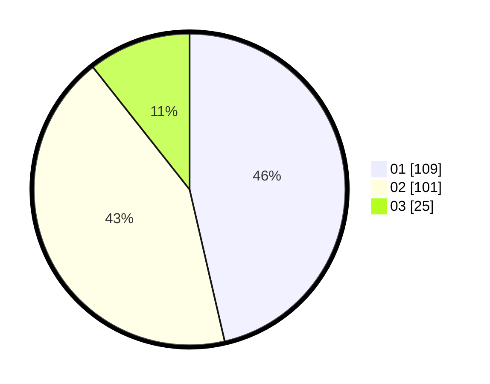

# Hasil

Hasil perolehan suara paslon dapat dilihat pada file paslon-01.txt, paslon-02.txt, dan paslon-03.txt.

Jika tidak ada, artinya data tersebut belum ada pada SIREKAP.

## Perolehan Suara

 * Paslon 01: **109**.
 * Paslon 02: **101**.
 * Paslon 03: **25**.

## Foto C Plano

https://sirekap-obj-formc.kpu.go.id/117b/pemilu/ppwp/31/73/01/10/01/3173011001061-20240215-024805--8452243d-9ee8-4f09-a296-d9be4cd1f73c.jpg

https://sirekap-obj-formc.kpu.go.id/117b/pemilu/ppwp/31/73/01/10/01/3173011001061-20240215-025302--de75ae0c-3d9f-4939-be71-7f024a4d5245.jpg

https://sirekap-obj-formc.kpu.go.id/117b/pemilu/ppwp/31/73/01/10/01/3173011001061-20240215-025131--12871a27-7783-4eaa-9433-7d1c75a6b438.jpg
