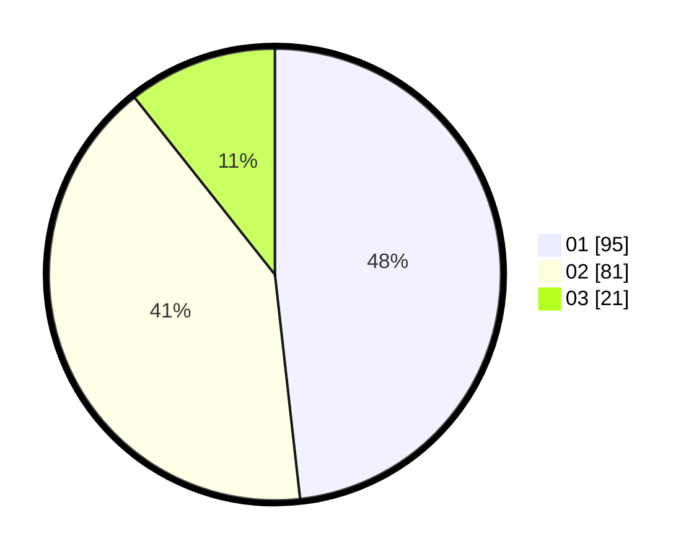

# Hasil

Hasil perolehan suara paslon dapat dilihat pada file paslon-01.txt, paslon-02.txt, dan paslon-03.txt.

Jika tidak ada, artinya data tersebut belum ada pada SIREKAP.

## Perolehan Suara

 * Paslon 01: **95**.
 * Paslon 02: **81**.
 * Paslon 03: **21**.

## Foto C Plano

https://sirekap-obj-formc.kpu.go.id/2f22/pemilu/ppwp/31/73/01/10/01/3173011001062-20240215-030923--73b82682-f447-43c3-af0a-91658905157c.jpg

https://sirekap-obj-formc.kpu.go.id/2f22/pemilu/ppwp/31/73/01/10/01/3173011001062-20240215-031014--784b837a-54b5-410c-9559-f27a6e89aa8e.jpg

https://sirekap-obj-formc.kpu.go.id/2f22/pemilu/ppwp/31/73/01/10/01/3173011001062-20240215-031114--bf318958-9eef-4918-b120-6da858d87d2e.jpg
