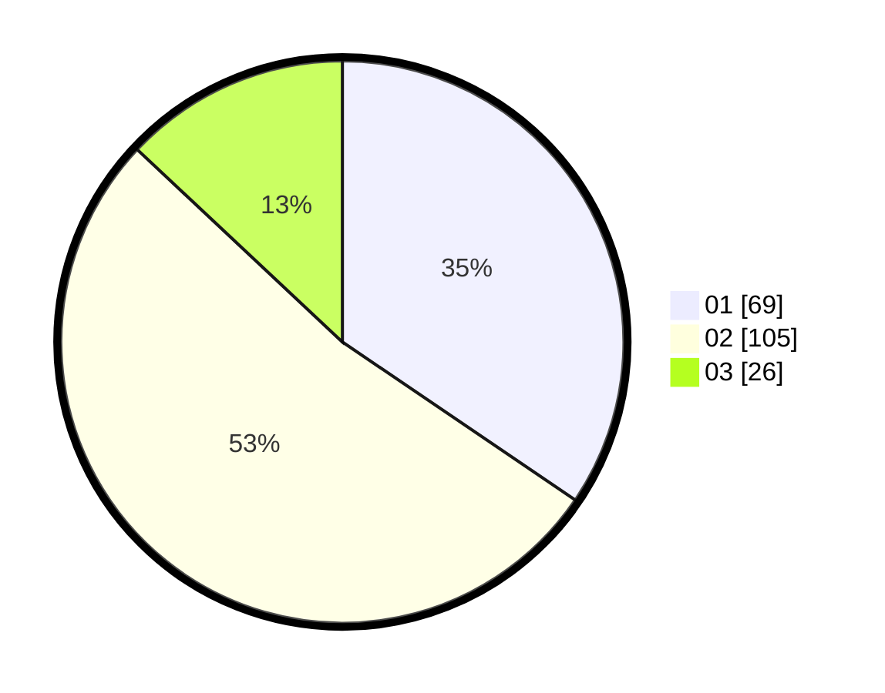

# Hasil

Hasil perolehan suara paslon dapat dilihat pada file paslon-01.txt, paslon-02.txt, dan paslon-03.txt.

Jika tidak ada, artinya data tersebut belum ada pada SIREKAP.

## Perolehan Suara

 * Paslon 01: **69**.
 * Paslon 02: **105**.
 * Paslon 03: **26**.

## Foto C Plano

https://sirekap-obj-formc.kpu.go.id/3c99/pemilu/ppwp/31/73/01/10/01/3173011001063-20240214-221848--45771ed0-b713-4d9a-bbbc-ee3740969b6d.jpg

https://sirekap-obj-formc.kpu.go.id/3c99/pemilu/ppwp/31/73/01/10/01/3173011001063-20240214-222037--70519c08-ea27-494f-84a6-d63ab48c561f.jpg

https://sirekap-obj-formc.kpu.go.id/3c99/pemilu/ppwp/31/73/01/10/01/3173011001063-20240214-222150--6042c4e6-129e-4390-bc4b-08c87211d6dc.jpg
