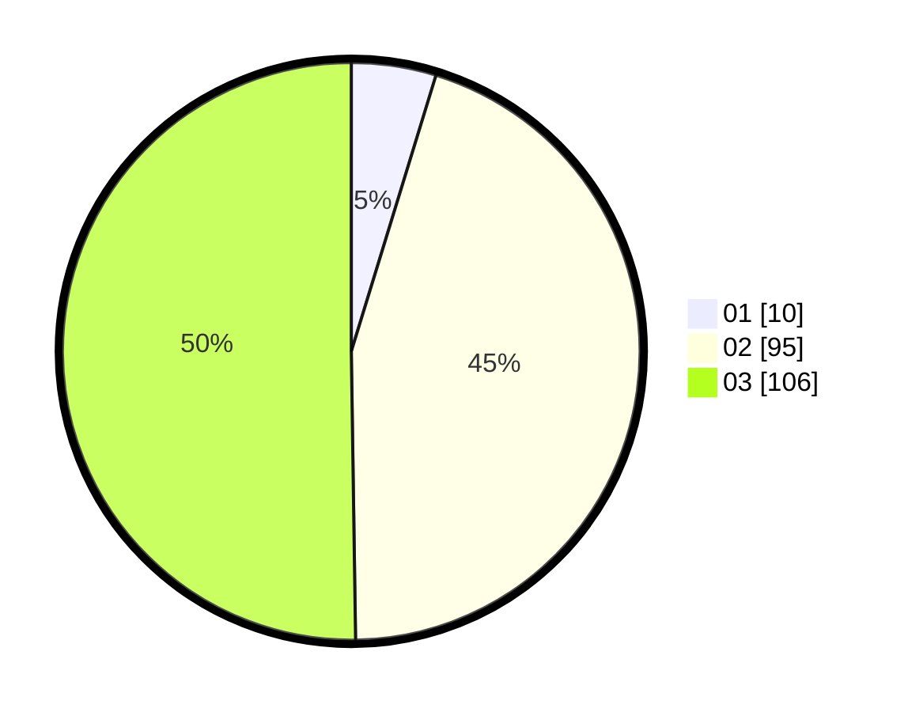

# Hasil

Hasil perolehan suara paslon dapat dilihat pada file paslon-01.txt, paslon-02.txt, dan paslon-03.txt.

Jika tidak ada, artinya data tersebut belum ada pada SIREKAP.

## Perolehan Suara

 * Paslon 01: **10**.
 * Paslon 02: **95**.
 * Paslon 03: **106**.

## Foto C Plano

https://sirekap-obj-formc.kpu.go.id/79be/pemilu/ppwp/31/73/01/10/01/3173011001069-20240215-013632--289e98e3-1dee-4004-8e6e-924bb160c3f2.jpg

https://sirekap-obj-formc.kpu.go.id/79be/pemilu/ppwp/31/73/01/10/01/3173011001069-20240215-013732--a22b74ad-5b70-4310-b933-9a9652990ba8.jpg

https://sirekap-obj-formc.kpu.go.id/79be/pemilu/ppwp/31/73/01/10/01/3173011001069-20240215-013816--8ffe4855-9e0a-4c44-8404-ed0b40eea08a.jpg
