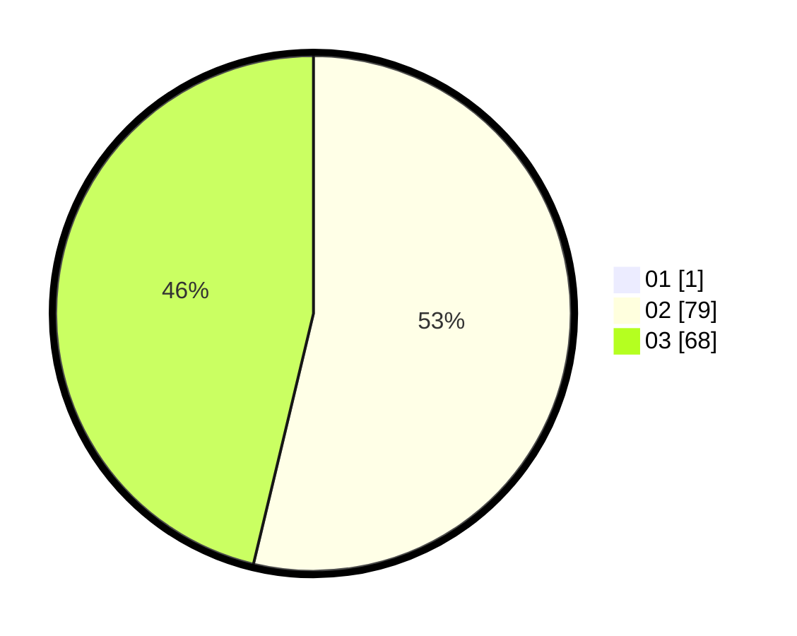

# Hasil

Hasil perolehan suara paslon dapat dilihat pada file paslon-01.txt, paslon-02.txt, dan paslon-03.txt.

Jika tidak ada, artinya data tersebut belum ada pada SIREKAP.

## Perolehan Suara

 * Paslon 01: **1**.
 * Paslon 02: **79**.
 * Paslon 03: **68**.

## Foto C Plano

https://sirekap-obj-formc.kpu.go.id/4261/pemilu/ppwp/31/73/01/10/01/3173011001070-20240214-202105--940a713d-f672-4eb0-b195-f8c2e20f5772.jpg

https://sirekap-obj-formc.kpu.go.id/4261/pemilu/ppwp/31/73/01/10/01/3173011001070-20240215-181317--c0d4907e-d23c-4286-a6b3-caf9cac84a95.jpg

https://sirekap-obj-formc.kpu.go.id/4261/pemilu/ppwp/31/73/01/10/01/3173011001070-20240214-215948--17a52c39-aa13-4312-9015-3d99315cc35d.jpg

## DATA PEMILIH TETAP

Jumlah pemilih dalam DPT: **149**.
 * L: **64**.
 * P: **85**.

## DATA PENGGUNA HAK PILIH

Jumlah pengguna hak pilih dalam DPT: **140**.
 * L: **58**.
 * P: **82**.

Jumlah pengguna hak pilih dalam DPTb: **1**.
 * L: **1**.
 * P: **0**.

Jumlah pengguna hak pilih dalam DPK: **8**.
 * L: **5**.
 * P: **3**.

Jumlah pengguna hak pilih: **149**.
 * L: **64**.
 * P: **85**.

## JUMLAH SUARA SAH DAN TIDAK SAH

JUMLAH SELURUH SUARA SAH: **148**.

JUMLAH SUARA TIDAK SAH: **1**.

JUMLAH SELURUH SUARA SAH DAN SUARA TIDAK SAH: **149**.
