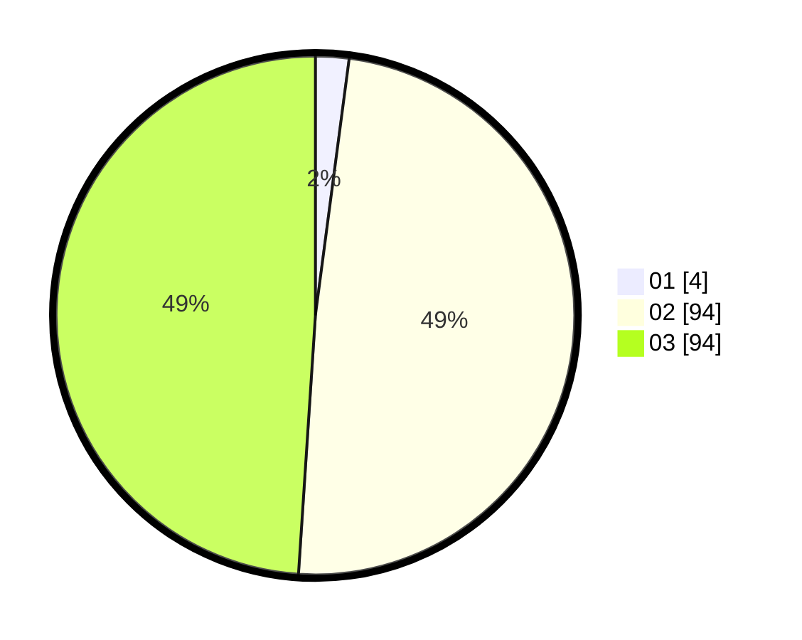

# Hasil

Hasil perolehan suara paslon dapat dilihat pada file paslon-01.txt, paslon-02.txt, dan paslon-03.txt.

Jika tidak ada, artinya data tersebut belum ada pada SIREKAP.

## Perolehan Suara

 * Paslon 01: **4**.
 * Paslon 02: **94**.
 * Paslon 03: **94**.

## Foto C Plano

https://sirekap-obj-formc.kpu.go.id/89af/pemilu/ppwp/31/73/01/10/01/3173011001071-20240214-190148--fd177cb5-afa0-4610-a71f-2814d2b98c1d.jpg

https://sirekap-obj-formc.kpu.go.id/89af/pemilu/ppwp/31/73/01/10/01/3173011001071-20240214-202935--d7bcdbaf-9c47-4e92-ab84-2b652bd192a2.jpg

https://sirekap-obj-formc.kpu.go.id/89af/pemilu/ppwp/31/73/01/10/01/3173011001071-20240214-190200--17d07b84-a87d-4ad5-b29a-ee2a40fb3443.jpg

## DATA PEMILIH TETAP

Jumlah pemilih dalam DPT: **235**.
 * L: **111**.
 * P: **124**.

## DATA PENGGUNA HAK PILIH

Jumlah pengguna hak pilih dalam DPT: **184**.
 * L: **85**.
 * P: **99**.

Jumlah pengguna hak pilih dalam DPTb: **4**.
 * L: **2**.
 * P: **2**.

Jumlah pengguna hak pilih dalam DPK: **4**.
 * L: **2**.
 * P: **2**.

Jumlah pengguna hak pilih: **192**.
 * L: **89**.
 * P: **103**.

## JUMLAH SUARA SAH DAN TIDAK SAH

JUMLAH SELURUH SUARA SAH: **192**.

JUMLAH SUARA TIDAK SAH: **0**.

JUMLAH SELURUH SUARA SAH DAN SUARA TIDAK SAH: **192**.
