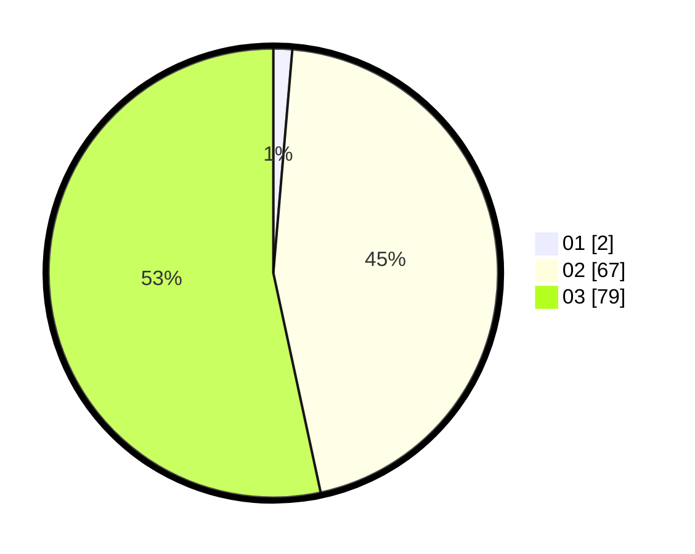

# Hasil

Hasil perolehan suara paslon dapat dilihat pada file paslon-01.txt, paslon-02.txt, dan paslon-03.txt.

Jika tidak ada, artinya data tersebut belum ada pada SIREKAP.

## Perolehan Suara

 * Paslon 01: **2**.
 * Paslon 02: **67**.
 * Paslon 03: **79**.

## Foto C Plano

https://sirekap-obj-formc.kpu.go.id/f0c4/pemilu/ppwp/31/73/01/10/01/3173011001072-20240215-211047--32007e44-8ce4-4dfc-8c5f-6d23a4be3982.jpg

https://sirekap-obj-formc.kpu.go.id/f0c4/pemilu/ppwp/31/73/01/10/01/3173011001072-20240215-211049--8ef75997-0d94-4a1a-b663-c44c7a2a1a30.jpg

https://sirekap-obj-formc.kpu.go.id/f0c4/pemilu/ppwp/31/73/01/10/01/3173011001072-20240215-211048--c939f0dd-ea7b-4cc7-9a0e-4103487f0d94.jpg

## DATA PEMILIH TETAP

Jumlah pemilih dalam DPT: **234**.
 * L: **116**.
 * P: **118**.

## DATA PENGGUNA HAK PILIH

Jumlah pengguna hak pilih dalam DPT: **149**.
 * L: **68**.
 * P: **81**.

Jumlah pengguna hak pilih dalam DPTb: **0**.
 * L: **0**.
 * P: **0**.

Jumlah pengguna hak pilih dalam DPK: **0**.
 * L: **0**.
 * P: **0**.

Jumlah pengguna hak pilih: **149**.
 * L: **68**.
 * P: **81**.

## JUMLAH SUARA SAH DAN TIDAK SAH

JUMLAH SELURUH SUARA SAH: **148**.

JUMLAH SUARA TIDAK SAH: **1**.

JUMLAH SELURUH SUARA SAH DAN SUARA TIDAK SAH: **149**.
