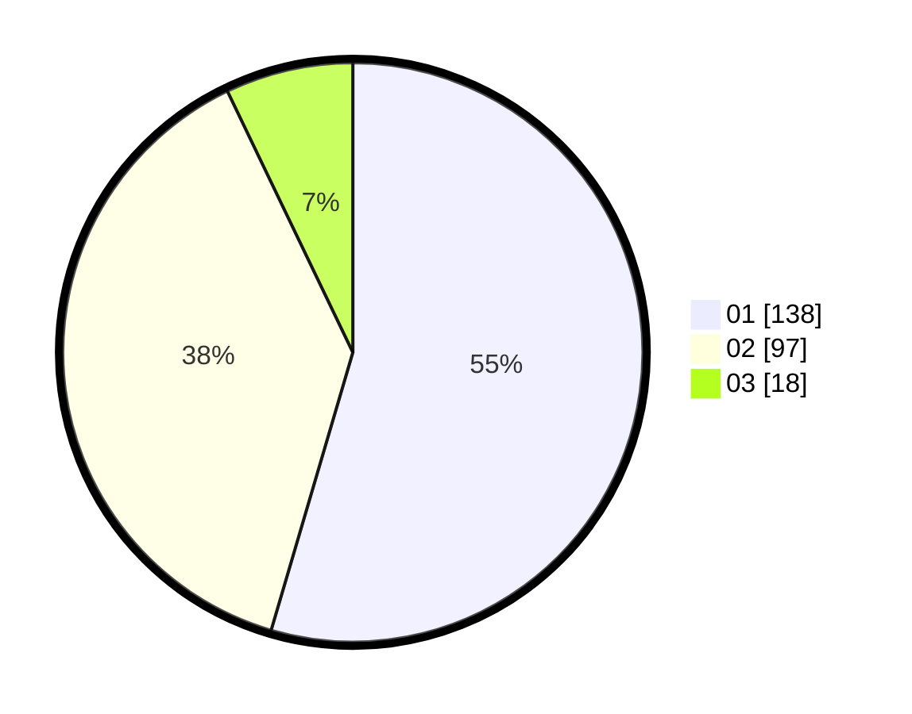

# Hasil

Hasil perolehan suara paslon dapat dilihat pada file paslon-01.txt, paslon-02.txt, dan paslon-03.txt.

Jika tidak ada, artinya data tersebut belum ada pada SIREKAP.

## Perolehan Suara

 * Paslon 01: **138**.
 * Paslon 02: **97**.
 * Paslon 03: **18**.

## Foto C Plano

https://sirekap-obj-formc.kpu.go.id/c378/pemilu/ppwp/31/73/01/10/01/3173011001075-20240214-185000--10720784-bc69-436d-bf61-5c69a8b28fcc.jpg

https://sirekap-obj-formc.kpu.go.id/c378/pemilu/ppwp/31/73/01/10/01/3173011001075-20240214-190015--1f268cc6-548e-47a4-9f93-8070948fae98.jpg

https://sirekap-obj-formc.kpu.go.id/c378/pemilu/ppwp/31/73/01/10/01/3173011001075-20240214-190813--05aab79d-b50b-47a6-8eda-43976bb317f6.jpg

## DATA PEMILIH TETAP

Jumlah pemilih dalam DPT: **294**.
 * L: **146**.
 * P: **148**.

## DATA PENGGUNA HAK PILIH

Jumlah pengguna hak pilih dalam DPT: **254**.
 * L: **727**.
 * P: **727**.

Jumlah pengguna hak pilih dalam DPTb: **1**.
 * L: **0**.
 * P: **1**.

Jumlah pengguna hak pilih dalam DPK: **0**.
 * L: **0**.
 * P: **0**.

Jumlah pengguna hak pilih: **255**.
 * L: **127**.
 * P: **128**.

## JUMLAH SUARA SAH DAN TIDAK SAH

JUMLAH SELURUH SUARA SAH: **253**.

JUMLAH SUARA TIDAK SAH: **2**.

JUMLAH SELURUH SUARA SAH DAN SUARA TIDAK SAH: **255**.
