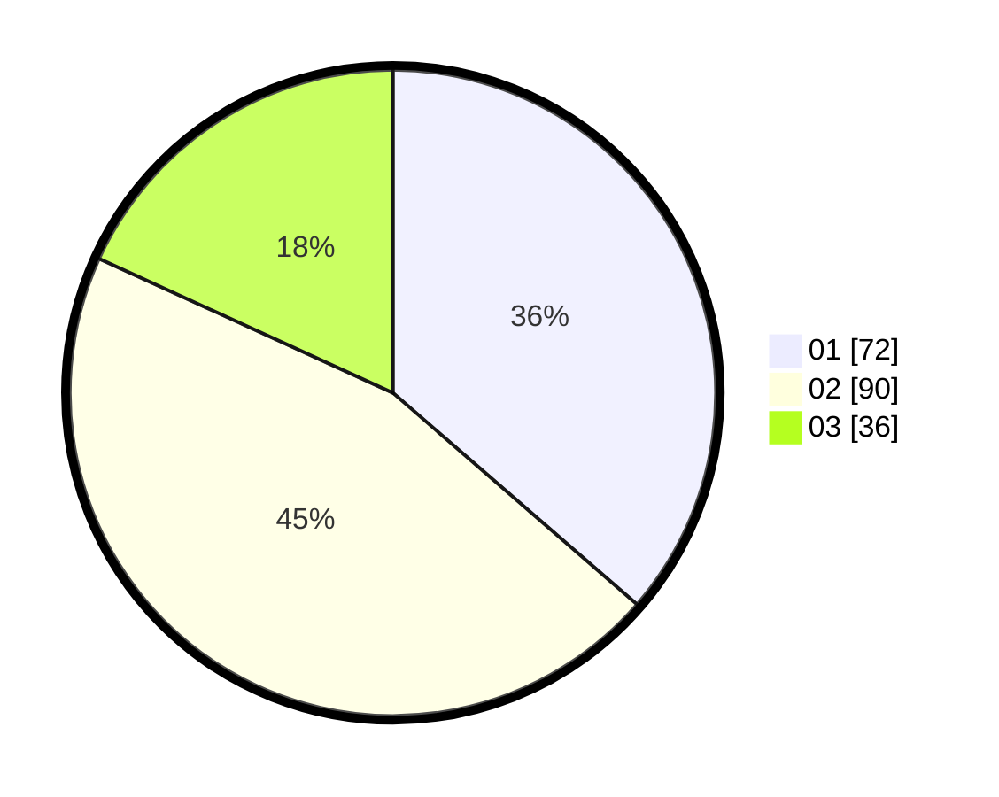

# Hasil

Hasil perolehan suara paslon dapat dilihat pada file paslon-01.txt, paslon-02.txt, dan paslon-03.txt.

Jika tidak ada, artinya data tersebut belum ada pada SIREKAP.

## Perolehan Suara

 * Paslon 01: **72**.
 * Paslon 02: **90**.
 * Paslon 03: **36**.

## Foto C Plano

https://sirekap-obj-formc.kpu.go.id/0cac/pemilu/ppwp/31/73/01/10/01/3173011001078-20240214-213526--15e33a5d-97cd-4195-9a13-c778d8d64949.jpg

https://sirekap-obj-formc.kpu.go.id/0cac/pemilu/ppwp/31/73/01/10/01/3173011001078-20240214-213633--4868d506-f4f9-4279-9c70-20af6b42f2b1.jpg

https://sirekap-obj-formc.kpu.go.id/0cac/pemilu/ppwp/31/73/01/10/01/3173011001078-20240214-213720--888818ad-7ec5-4369-92a0-ae016c2c468d.jpg
