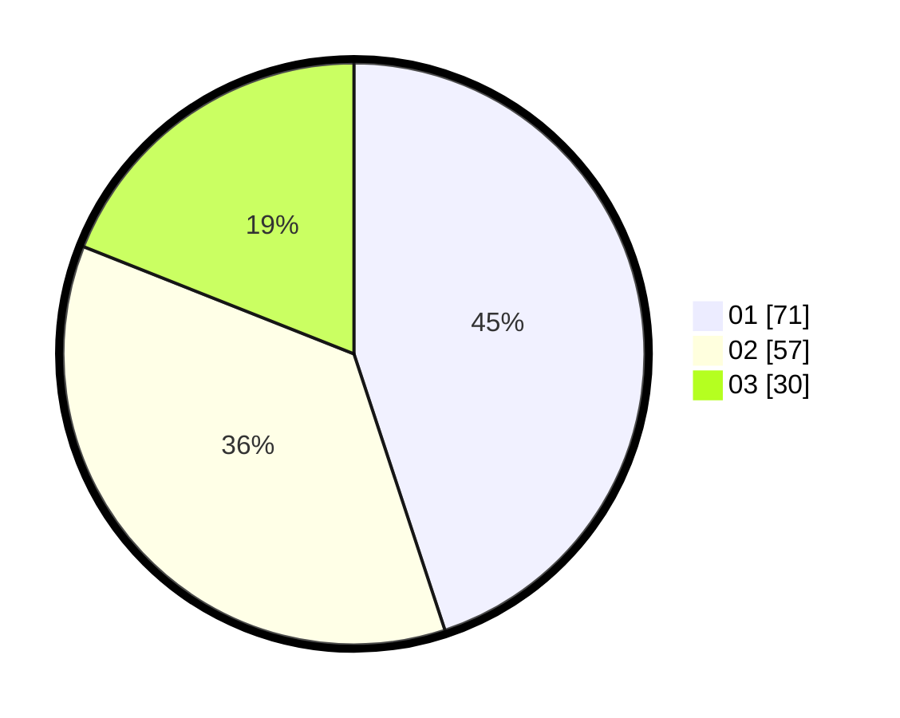

# Hasil

Hasil perolehan suara paslon dapat dilihat pada file paslon-01.txt, paslon-02.txt, dan paslon-03.txt.

Jika tidak ada, artinya data tersebut belum ada pada SIREKAP.

## Perolehan Suara

 * Paslon 01: **71**.
 * Paslon 02: **57**.
 * Paslon 03: **30**.

## Foto C Plano

https://sirekap-obj-formc.kpu.go.id/8e0a/pemilu/ppwp/31/73/01/10/01/3173011001080-20240215-151523--9376c6e3-210b-42cd-8c10-a7df6d1d5e78.jpg

https://sirekap-obj-formc.kpu.go.id/8e0a/pemilu/ppwp/31/73/01/10/01/3173011001080-20240215-151545--84edc730-9e57-4c6f-83f1-26b49ee29533.jpg

https://sirekap-obj-formc.kpu.go.id/8e0a/pemilu/ppwp/31/73/01/10/01/3173011001080-20240215-151534--d1cb6841-c537-4641-b027-c99eaf197e3c.jpg

## DATA PEMILIH TETAP

Jumlah pemilih dalam DPT: **214**.
 * L: **117**.
 * P: **97**.

## DATA PENGGUNA HAK PILIH

Jumlah pengguna hak pilih dalam DPT: **154**.
 * L: **78**.
 * P: **76**.

Jumlah pengguna hak pilih dalam DPTb: **2**.
 * L: **1**.
 * P: **1**.

Jumlah pengguna hak pilih dalam DPK: **4**.
 * L: **2**.
 * P: **2**.

Jumlah pengguna hak pilih: **160**.
 * L: **81**.
 * P: **79**.

## JUMLAH SUARA SAH DAN TIDAK SAH

JUMLAH SELURUH SUARA SAH: **158**.

JUMLAH SUARA TIDAK SAH: **2**.

JUMLAH SELURUH SUARA SAH DAN SUARA TIDAK SAH: **160**.
