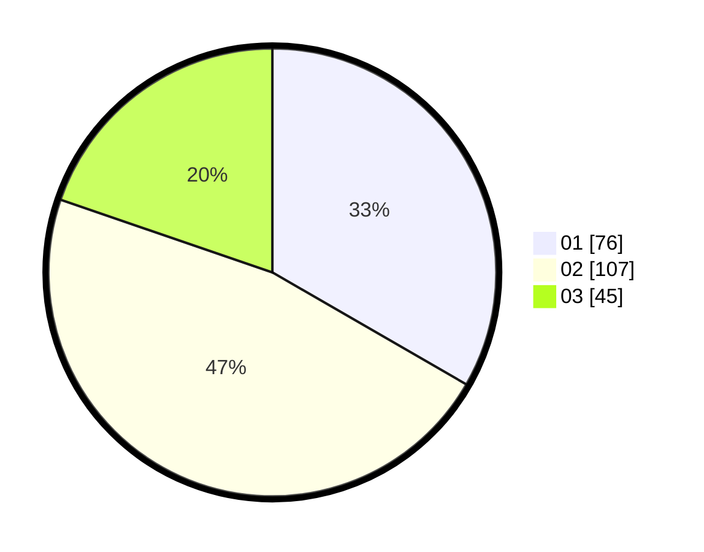

# Hasil

Hasil perolehan suara paslon dapat dilihat pada file paslon-01.txt, paslon-02.txt, dan paslon-03.txt.

Jika tidak ada, artinya data tersebut belum ada pada SIREKAP.

## Perolehan Suara

 * Paslon 01: **76**.
 * Paslon 02: **107**.
 * Paslon 03: **45**.

## Foto C Plano

https://sirekap-obj-formc.kpu.go.id/99ba/pemilu/ppwp/31/73/01/10/01/3173011001081-20240219-001744--844df3d1-8441-4b66-988a-cc9265c269c6.jpg

https://sirekap-obj-formc.kpu.go.id/99ba/pemilu/ppwp/31/73/01/10/01/3173011001081-20240219-001745--9593d8e5-a41c-4916-bed8-e9936a4c5eba.jpg

https://sirekap-obj-formc.kpu.go.id/99ba/pemilu/ppwp/31/73/01/10/01/3173011001081-20240219-001745--d6d19f3c-e3e5-493f-ad7e-368f6b9da2c1.jpg

## DATA PEMILIH TETAP

Jumlah pemilih dalam DPT: **0**.
 * L: **0**.
 * P: **0**.

## DATA PENGGUNA HAK PILIH

Jumlah pengguna hak pilih dalam DPT: **0**.
 * L: **0**.
 * P: **0**.

Jumlah pengguna hak pilih dalam DPTb: **0**.
 * L: **0**.
 * P: **0**.

Jumlah pengguna hak pilih dalam DPK: **0**.
 * L: **0**.
 * P: **0**.

Jumlah pengguna hak pilih: **0**.
 * L: **0**.
 * P: **0**.

## JUMLAH SUARA SAH DAN TIDAK SAH

JUMLAH SELURUH SUARA SAH: **228**.

JUMLAH SUARA TIDAK SAH: **2**.

JUMLAH SELURUH SUARA SAH DAN SUARA TIDAK SAH: **230**.
