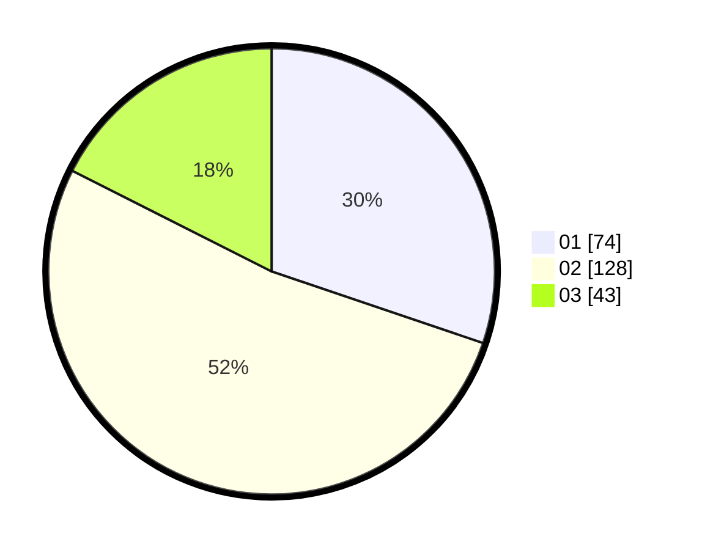

# Hasil

Hasil perolehan suara paslon dapat dilihat pada file paslon-01.txt, paslon-02.txt, dan paslon-03.txt.

Jika tidak ada, artinya data tersebut belum ada pada SIREKAP.

## Perolehan Suara

 * Paslon 01: **74**.
 * Paslon 02: **128**.
 * Paslon 03: **43**.

## Foto C Plano

https://sirekap-obj-formc.kpu.go.id/249e/pemilu/ppwp/31/73/01/10/01/3173011001082-20240214-235656--51df1f13-8f95-4cb7-ae36-8bea38ef33b9.jpg

https://sirekap-obj-formc.kpu.go.id/249e/pemilu/ppwp/31/73/01/10/01/3173011001082-20240214-235840--beb3779c-c5aa-41f6-b974-840e1631698a.jpg

https://sirekap-obj-formc.kpu.go.id/249e/pemilu/ppwp/31/73/01/10/01/3173011001082-20240215-000534--4e9a5f62-e332-498d-bc6d-e00e5d03d210.jpg
