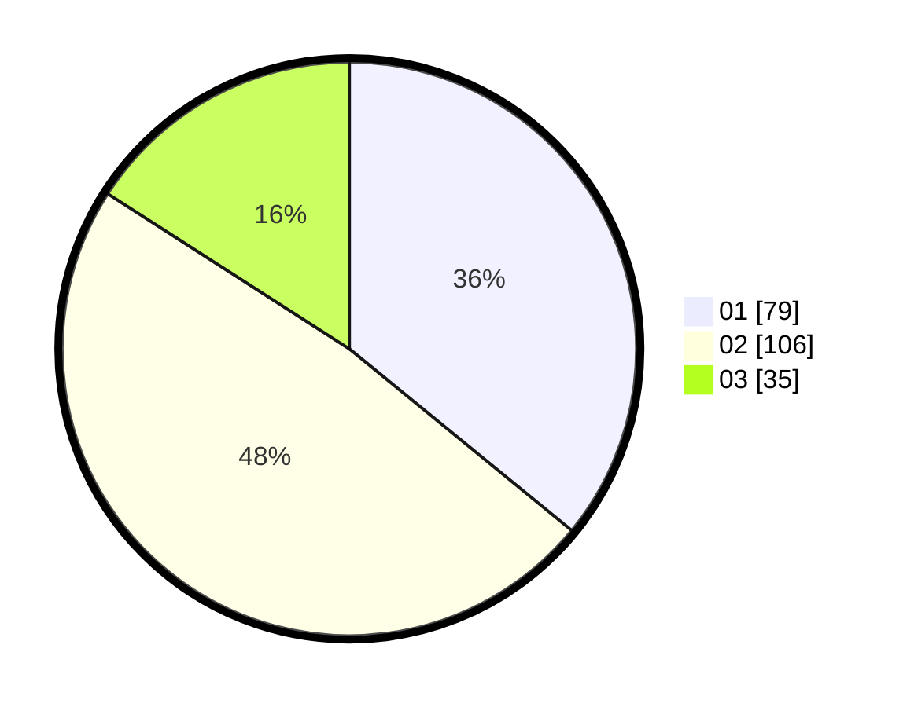

# Hasil

Hasil perolehan suara paslon dapat dilihat pada file paslon-01.txt, paslon-02.txt, dan paslon-03.txt.

Jika tidak ada, artinya data tersebut belum ada pada SIREKAP.

## Perolehan Suara

 * Paslon 01: **79**.
 * Paslon 02: **106**.
 * Paslon 03: **35**.

## Foto C Plano

https://sirekap-obj-formc.kpu.go.id/e35a/pemilu/ppwp/31/73/01/10/01/3173011001085-20240214-224119--f96a1927-7d08-45c3-94b3-e41f07997eed.jpg

https://sirekap-obj-formc.kpu.go.id/e35a/pemilu/ppwp/31/73/01/10/01/3173011001085-20240214-233447--2ca32564-7255-4e7a-b6e0-d64fd76abb39.jpg

https://sirekap-obj-formc.kpu.go.id/e35a/pemilu/ppwp/31/73/01/10/01/3173011001085-20240214-233558--5f0cc46f-0c3e-4ea7-b1eb-5b56b1cc873e.jpg
