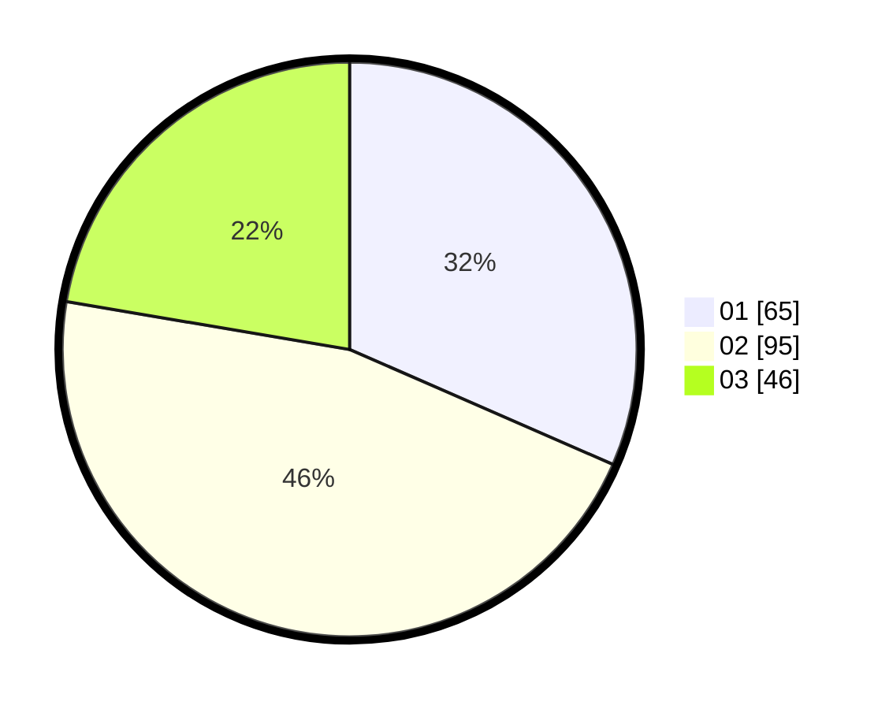

# Hasil

Hasil perolehan suara paslon dapat dilihat pada file paslon-01.txt, paslon-02.txt, dan paslon-03.txt.

Jika tidak ada, artinya data tersebut belum ada pada SIREKAP.

## Perolehan Suara

 * Paslon 01: **65**.
 * Paslon 02: **95**.
 * Paslon 03: **46**.

## Foto C Plano

https://sirekap-obj-formc.kpu.go.id/a42a/pemilu/ppwp/31/73/01/10/01/3173011001086-20240214-230045--8ee49693-7f3e-4a9e-baa5-257d44216800.jpg

https://sirekap-obj-formc.kpu.go.id/a42a/pemilu/ppwp/31/73/01/10/01/3173011001086-20240214-230239--0da07945-6c22-48c1-8f15-a4c26f6c6fe7.jpg

https://sirekap-obj-formc.kpu.go.id/a42a/pemilu/ppwp/31/73/01/10/01/3173011001086-20240214-230343--96596bc3-eeb0-4f09-9aab-6190bc934e87.jpg

## DATA PEMILIH TETAP

Jumlah pemilih dalam DPT: **281**.
 * L: **141**.
 * P: **140**.

## DATA PENGGUNA HAK PILIH

Jumlah pengguna hak pilih dalam DPT: **195**.
 * L: **91**.
 * P: **104**.

Jumlah pengguna hak pilih dalam DPTb: **2**.
 * L: **1**.
 * P: **1**.

Jumlah pengguna hak pilih dalam DPK: **11**.
 * L: **5**.
 * P: **6**.

Jumlah pengguna hak pilih: **208**.
 * L: **97**.
 * P: **111**.

## JUMLAH SUARA SAH DAN TIDAK SAH

JUMLAH SELURUH SUARA SAH: **206**.

JUMLAH SUARA TIDAK SAH: **2**.

JUMLAH SELURUH SUARA SAH DAN SUARA TIDAK SAH: **208**.
