# Hasil

Hasil perolehan suara paslon dapat dilihat pada file paslon-01.txt, paslon-02.txt, dan paslon-03.txt.

Jika tidak ada, artinya data tersebut belum ada pada SIREKAP.

## Perolehan Suara

 * Paslon 01: **92**.
 * Paslon 02: **98**.
 * Paslon 03: **20**.

```mermaid
%%{init: {"pie": {"textPosition": 0.5}, "themeVariables": {"pieOuterStrokeWidth": "5px"}} }%%
pie showData
    "01" : 92
    "02" : 98
    "03" : 20
```

## Foto C Plano

https://sirekap-obj-formc.kpu.go.id/9b4c/pemilu/ppwp/31/73/01/10/01/3173011001091-20240214-222205--3926a976-534c-4a5c-93e8-9dc0f7017b82.jpg

https://sirekap-obj-formc.kpu.go.id/9b4c/pemilu/ppwp/31/73/01/10/01/3173011001091-20240214-222322--604b7dfb-ca1a-4447-96c4-72b144b14f40.jpg

https://sirekap-obj-formc.kpu.go.id/9b4c/pemilu/ppwp/31/73/01/10/01/3173011001091-20240214-222450--be95e928-12e9-4b3a-b5ff-a981bc1e4e41.jpg
