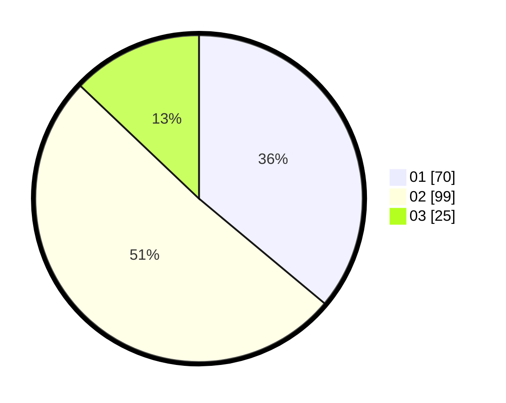

# Hasil

Hasil perolehan suara paslon dapat dilihat pada file paslon-01.txt, paslon-02.txt, dan paslon-03.txt.

Jika tidak ada, artinya data tersebut belum ada pada SIREKAP.

## Perolehan Suara

 * Paslon 01: **70**.
 * Paslon 02: **99**.
 * Paslon 03: **25**.

## Foto C Plano

https://sirekap-obj-formc.kpu.go.id/7170/pemilu/ppwp/31/73/01/10/01/3173011001092-20240214-193237--cd16c258-7a53-4a7e-9288-549f2a5c1d29.jpg

https://sirekap-obj-formc.kpu.go.id/7170/pemilu/ppwp/31/73/01/10/01/3173011001092-20240214-193627--ec8b56a8-b467-4adf-afe1-6b4107f2d24e.jpg

https://sirekap-obj-formc.kpu.go.id/7170/pemilu/ppwp/31/73/01/10/01/3173011001092-20240214-193811--92808d14-11a8-4a34-8a15-33d5ccb77835.jpg

## DATA PEMILIH TETAP

Jumlah pemilih dalam DPT: **281**.
 * L: **134**.
 * P: **147**.

## DATA PENGGUNA HAK PILIH

Jumlah pengguna hak pilih dalam DPT: **196**.
 * L: **89**.
 * P: **107**.

Jumlah pengguna hak pilih dalam DPTb: **1**.
 * L: **1**.
 * P: **0**.

Jumlah pengguna hak pilih dalam DPK: **2**.
 * L: **1**.
 * P: **1**.

Jumlah pengguna hak pilih: **199**.
 * L: **91**.
 * P: **108**.

## JUMLAH SUARA SAH DAN TIDAK SAH

JUMLAH SELURUH SUARA SAH: **194**.

JUMLAH SUARA TIDAK SAH: **5**.

JUMLAH SELURUH SUARA SAH DAN SUARA TIDAK SAH: **199**.
