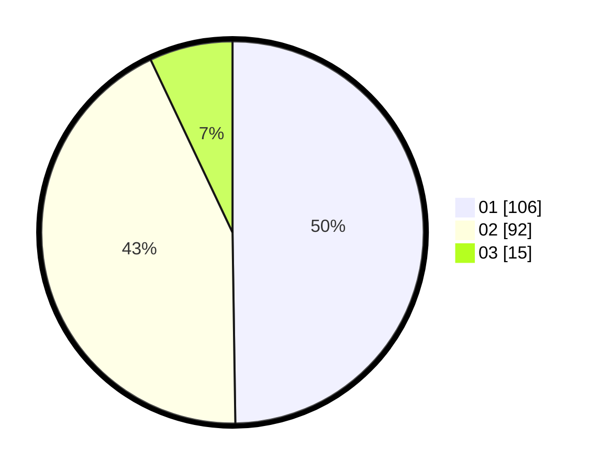

# Hasil

Hasil perolehan suara paslon dapat dilihat pada file paslon-01.txt, paslon-02.txt, dan paslon-03.txt.

Jika tidak ada, artinya data tersebut belum ada pada SIREKAP.

## Perolehan Suara

 * Paslon 01: **106**.
 * Paslon 02: **92**.
 * Paslon 03: **15**.

## Foto C Plano

https://sirekap-obj-formc.kpu.go.id/a371/pemilu/ppwp/31/73/01/10/01/3173011001093-20240215-014638--0defcebe-511d-46e3-acc1-054517a420ec.jpg

https://sirekap-obj-formc.kpu.go.id/a371/pemilu/ppwp/31/73/01/10/01/3173011001093-20240214-203532--4be282e4-07a0-4d3b-8521-2d72971793f9.jpg

https://sirekap-obj-formc.kpu.go.id/a371/pemilu/ppwp/31/73/01/10/01/3173011001093-20240214-203539--d10378ca-a66a-4779-8eab-a6dc370b72a2.jpg
