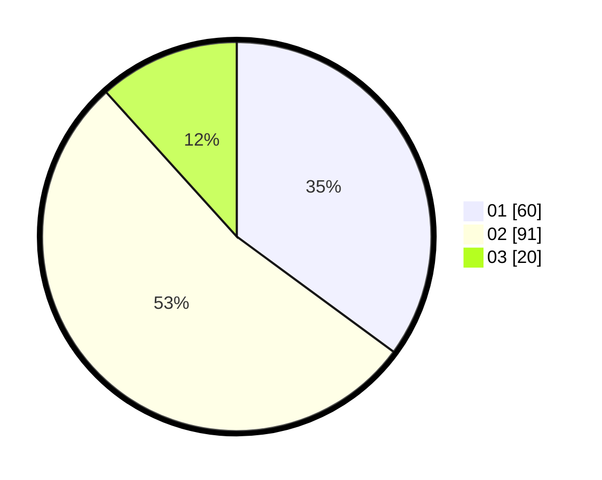

# Hasil

Hasil perolehan suara paslon dapat dilihat pada file paslon-01.txt, paslon-02.txt, dan paslon-03.txt.

Jika tidak ada, artinya data tersebut belum ada pada SIREKAP.

## Perolehan Suara

 * Paslon 01: **60**.
 * Paslon 02: **91**.
 * Paslon 03: **20**.

## Foto C Plano

https://sirekap-obj-formc.kpu.go.id/229c/pemilu/ppwp/31/73/01/10/01/3173011001096-20240214-192501--827ff9e2-d15c-41c1-a712-f47607046162.jpg

https://sirekap-obj-formc.kpu.go.id/229c/pemilu/ppwp/31/73/01/10/01/3173011001096-20240214-192155--2247344a-0138-4c4b-8e12-1195a6dd64b0.jpg

https://sirekap-obj-formc.kpu.go.id/229c/pemilu/ppwp/31/73/01/10/01/3173011001096-20240214-192321--220d5064-a664-4b33-a240-e559e9eec997.jpg

## DATA PEMILIH TETAP

Jumlah pemilih dalam DPT: **216**.
 * L: **110**.
 * P: **106**.

## DATA PENGGUNA HAK PILIH

Jumlah pengguna hak pilih dalam DPT: **172**.
 * L: **86**.
 * P: **86**.

Jumlah pengguna hak pilih dalam DPTb: **1**.
 * L: **1**.
 * P: **0**.

Jumlah pengguna hak pilih dalam DPK: **2**.
 * L: **0**.
 * P: **2**.

Jumlah pengguna hak pilih: **175**.
 * L: **87**.
 * P: **88**.

## JUMLAH SUARA SAH DAN TIDAK SAH

JUMLAH SELURUH SUARA SAH: **171**.

JUMLAH SUARA TIDAK SAH: **4**.

JUMLAH SELURUH SUARA SAH DAN SUARA TIDAK SAH: **175**.
