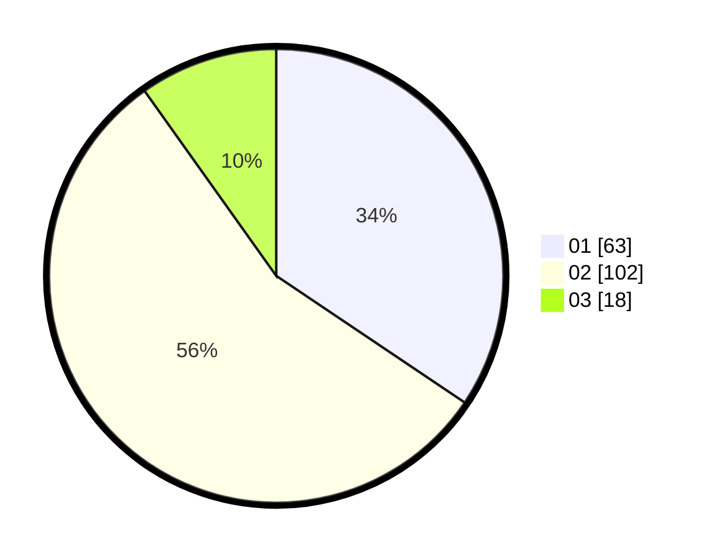

# Hasil

Hasil perolehan suara paslon dapat dilihat pada file paslon-01.txt, paslon-02.txt, dan paslon-03.txt.

Jika tidak ada, artinya data tersebut belum ada pada SIREKAP.

## Perolehan Suara

 * Paslon 01: **63**.
 * Paslon 02: **102**.
 * Paslon 03: **18**.

## Foto C Plano

https://sirekap-obj-formc.kpu.go.id/fdcd/pemilu/ppwp/31/73/01/10/01/3173011001100-20240214-194540--e77a7906-1529-49d6-b291-d5894553ca7a.jpg

https://sirekap-obj-formc.kpu.go.id/fdcd/pemilu/ppwp/31/73/01/10/01/3173011001100-20240214-190610--abfbbb8a-a681-449c-a9ed-0da7d46229ba.jpg

https://sirekap-obj-formc.kpu.go.id/fdcd/pemilu/ppwp/31/73/01/10/01/3173011001100-20240214-194338--2fd7cd20-5803-4c3b-b934-3589c9a6445e.jpg

## DATA PEMILIH TETAP

Jumlah pemilih dalam DPT: **244**.
 * L: **128**.
 * P: **116**.

## DATA PENGGUNA HAK PILIH

Jumlah pengguna hak pilih dalam DPT: **181**.
 * L: **128**.
 * P: **116**.

Jumlah pengguna hak pilih dalam DPTb: **3**.
 * L: **1**.
 * P: **2**.

Jumlah pengguna hak pilih dalam DPK: **1**.
 * L: **0**.
 * P: **1**.

Jumlah pengguna hak pilih: **185**.
 * L: **88**.
 * P: **97**.

## JUMLAH SUARA SAH DAN TIDAK SAH

JUMLAH SELURUH SUARA SAH: **183**.

JUMLAH SUARA TIDAK SAH: **2**.

JUMLAH SELURUH SUARA SAH DAN SUARA TIDAK SAH: **185**.
