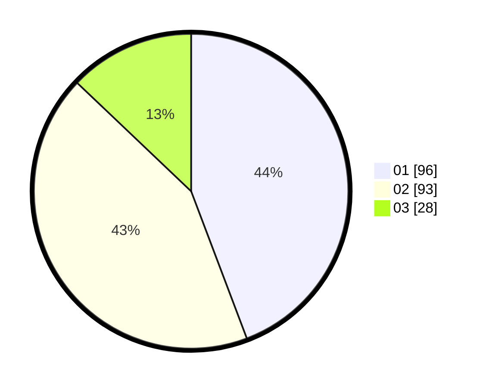

# Hasil

Hasil perolehan suara paslon dapat dilihat pada file paslon-01.txt, paslon-02.txt, dan paslon-03.txt.

Jika tidak ada, artinya data tersebut belum ada pada SIREKAP.

## Perolehan Suara

 * Paslon 01: **96**.
 * Paslon 02: **93**.
 * Paslon 03: **28**.

## Foto C Plano

https://sirekap-obj-formc.kpu.go.id/fa2c/pemilu/ppwp/31/73/01/10/01/3173011001101-20240215-004249--3f8482ac-498d-40fb-b307-e744a2378471.jpg

https://sirekap-obj-formc.kpu.go.id/fa2c/pemilu/ppwp/31/73/01/10/01/3173011001101-20240215-004317--cd0d157d-dfd5-452a-92b8-808763330375.jpg

https://sirekap-obj-formc.kpu.go.id/fa2c/pemilu/ppwp/31/73/01/10/01/3173011001101-20240215-004347--0dc242e0-35b3-467f-906f-65f896512660.jpg
