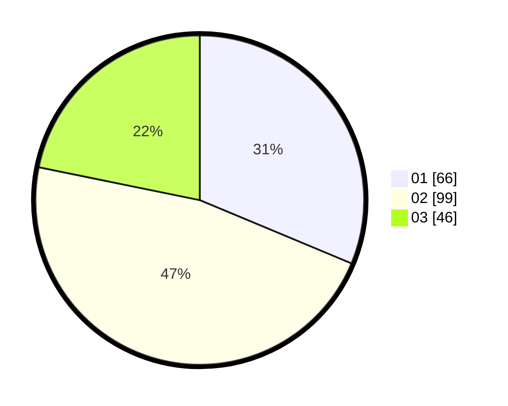

# Hasil

Hasil perolehan suara paslon dapat dilihat pada file paslon-01.txt, paslon-02.txt, dan paslon-03.txt.

Jika tidak ada, artinya data tersebut belum ada pada SIREKAP.

## Perolehan Suara

 * Paslon 01: **66**.
 * Paslon 02: **99**.
 * Paslon 03: **46**.

## Foto C Plano

https://sirekap-obj-formc.kpu.go.id/34d2/pemilu/ppwp/31/73/01/10/01/3173011001108-20240214-232504--4b0a7ec0-0cba-4565-a9cd-8b75501d0712.jpg

https://sirekap-obj-formc.kpu.go.id/34d2/pemilu/ppwp/31/73/01/10/01/3173011001108-20240214-232548--6e6b36ce-70c2-4805-b3a6-75c559fc986f.jpg

https://sirekap-obj-formc.kpu.go.id/34d2/pemilu/ppwp/31/73/01/10/01/3173011001108-20240214-232626--72a01712-a0b7-472f-9fef-e6bd8359457a.jpg
