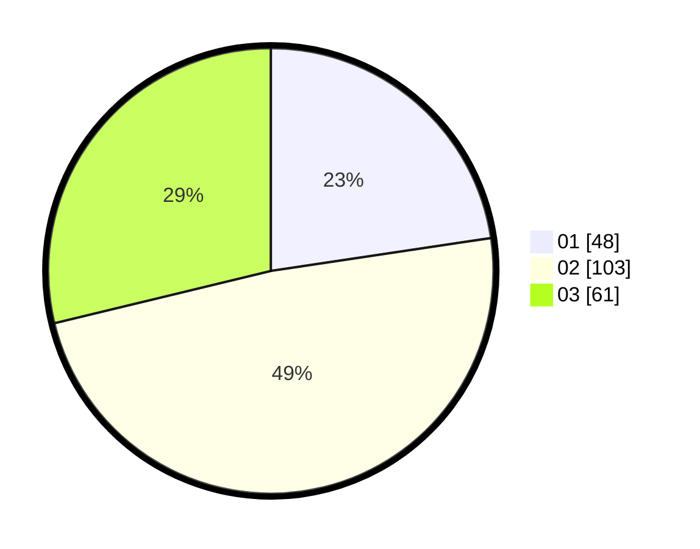

# Hasil

Hasil perolehan suara paslon dapat dilihat pada file paslon-01.txt, paslon-02.txt, dan paslon-03.txt.

Jika tidak ada, artinya data tersebut belum ada pada SIREKAP.

## Perolehan Suara

 * Paslon 01: **48**.
 * Paslon 02: **103**.
 * Paslon 03: **61**.

## Foto C Plano

https://sirekap-obj-formc.kpu.go.id/526f/pemilu/ppwp/31/73/01/10/01/3173011001112-20240214-222749--6d33b249-3779-4e80-bda5-8ddfb3697f20.jpg

https://sirekap-obj-formc.kpu.go.id/526f/pemilu/ppwp/31/73/01/10/01/3173011001112-20240214-220342--ee7fae11-a301-424e-b3ec-5da8faadf057.jpg

https://sirekap-obj-formc.kpu.go.id/526f/pemilu/ppwp/31/73/01/10/01/3173011001112-20240214-220424--282636a4-8b02-4595-a45f-a5a41706517b.jpg
