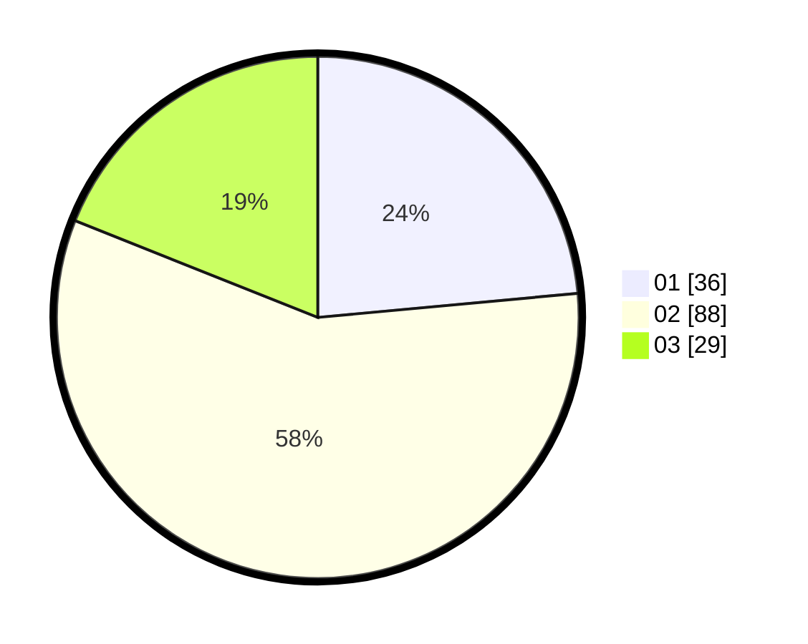

# Hasil

Hasil perolehan suara paslon dapat dilihat pada file paslon-01.txt, paslon-02.txt, dan paslon-03.txt.

Jika tidak ada, artinya data tersebut belum ada pada SIREKAP.

## Perolehan Suara

 * Paslon 01: **36**.
 * Paslon 02: **88**.
 * Paslon 03: **29**.

## Foto C Plano

https://sirekap-obj-formc.kpu.go.id/680e/pemilu/ppwp/31/73/01/10/01/3173011001115-20240214-185812--0af6e734-12e8-4bb1-ab4f-26dcbbb90b4c.jpg

https://sirekap-obj-formc.kpu.go.id/680e/pemilu/ppwp/31/73/01/10/01/3173011001115-20240214-190001--ef2d8c13-0faa-421e-b79b-6270eae2437d.jpg

https://sirekap-obj-formc.kpu.go.id/680e/pemilu/ppwp/31/73/01/10/01/3173011001115-20240214-190057--7e1f3851-0459-4d67-8de6-8d729daeb512.jpg

## DATA PEMILIH TETAP

Jumlah pemilih dalam DPT: **211**.
 * L: **114**.
 * P: **97**.

## DATA PENGGUNA HAK PILIH

Jumlah pengguna hak pilih dalam DPT: **158**.
 * L: **81**.
 * P: **77**.

Jumlah pengguna hak pilih dalam DPTb: **0**.
 * L: **0**.
 * P: **0**.

Jumlah pengguna hak pilih dalam DPK: **0**.
 * L: **0**.
 * P: **0**.

Jumlah pengguna hak pilih: **158**.
 * L: **81**.
 * P: **77**.

## JUMLAH SUARA SAH DAN TIDAK SAH

JUMLAH SELURUH SUARA SAH: **153**.

JUMLAH SUARA TIDAK SAH: **5**.

JUMLAH SELURUH SUARA SAH DAN SUARA TIDAK SAH: **158**.
