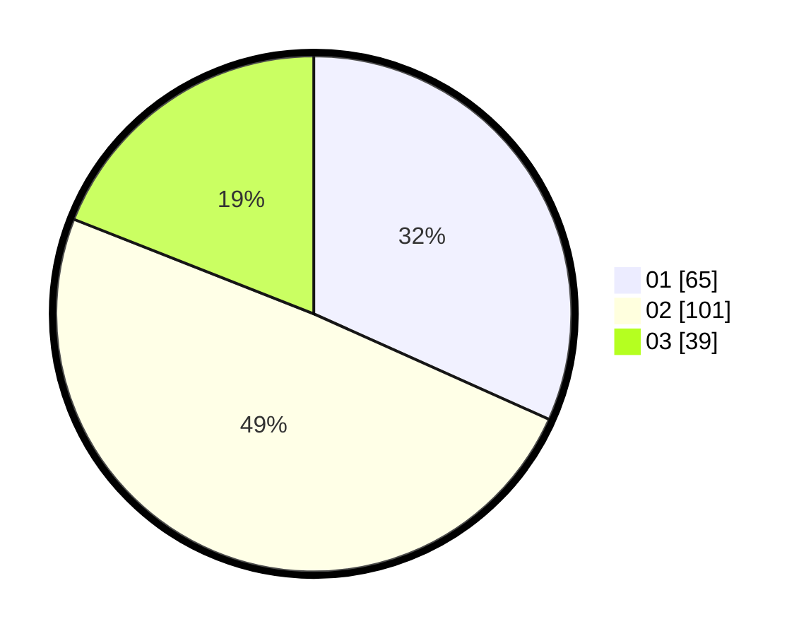

# Hasil

Hasil perolehan suara paslon dapat dilihat pada file paslon-01.txt, paslon-02.txt, dan paslon-03.txt.

Jika tidak ada, artinya data tersebut belum ada pada SIREKAP.

## Perolehan Suara

 * Paslon 01: **65**.
 * Paslon 02: **101**.
 * Paslon 03: **39**.

## Foto C Plano

https://sirekap-obj-formc.kpu.go.id/772b/pemilu/ppwp/31/73/01/10/01/3173011001117-20240214-225744--0a5e52ff-c843-4f54-8145-f25f808039af.jpg

https://sirekap-obj-formc.kpu.go.id/772b/pemilu/ppwp/31/73/01/10/01/3173011001117-20240214-230055--b9ba6709-afc0-4063-9cfa-46bc33307a57.jpg

https://sirekap-obj-formc.kpu.go.id/772b/pemilu/ppwp/31/73/01/10/01/3173011001117-20240214-230307--089260e2-eba7-45fd-9b04-ebc0cd0da23c.jpg
