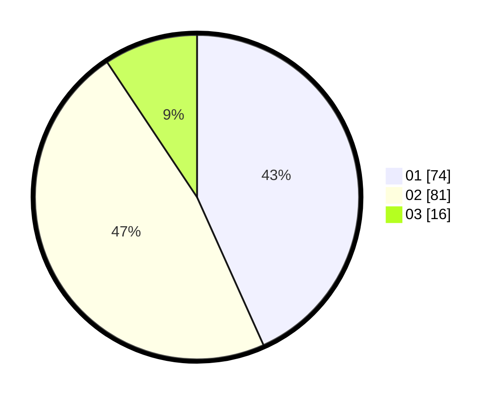

# Hasil

Hasil perolehan suara paslon dapat dilihat pada file paslon-01.txt, paslon-02.txt, dan paslon-03.txt.

Jika tidak ada, artinya data tersebut belum ada pada SIREKAP.

## Perolehan Suara

 * Paslon 01: **74**.
 * Paslon 02: **81**.
 * Paslon 03: **16**.

## Foto C Plano

https://sirekap-obj-formc.kpu.go.id/98f1/pemilu/ppwp/31/73/01/10/01/3173011001118-20240214-212728--a1b1ccdb-9174-47cf-8050-7c077adcb1f1.jpg

https://sirekap-obj-formc.kpu.go.id/98f1/pemilu/ppwp/31/73/01/10/01/3173011001118-20240214-213031--177dd0ea-716e-4437-8937-76adf60e6ca7.jpg

https://sirekap-obj-formc.kpu.go.id/98f1/pemilu/ppwp/31/73/01/10/01/3173011001118-20240214-213145--a361ab37-6eb5-45e4-a325-11739c722642.jpg
