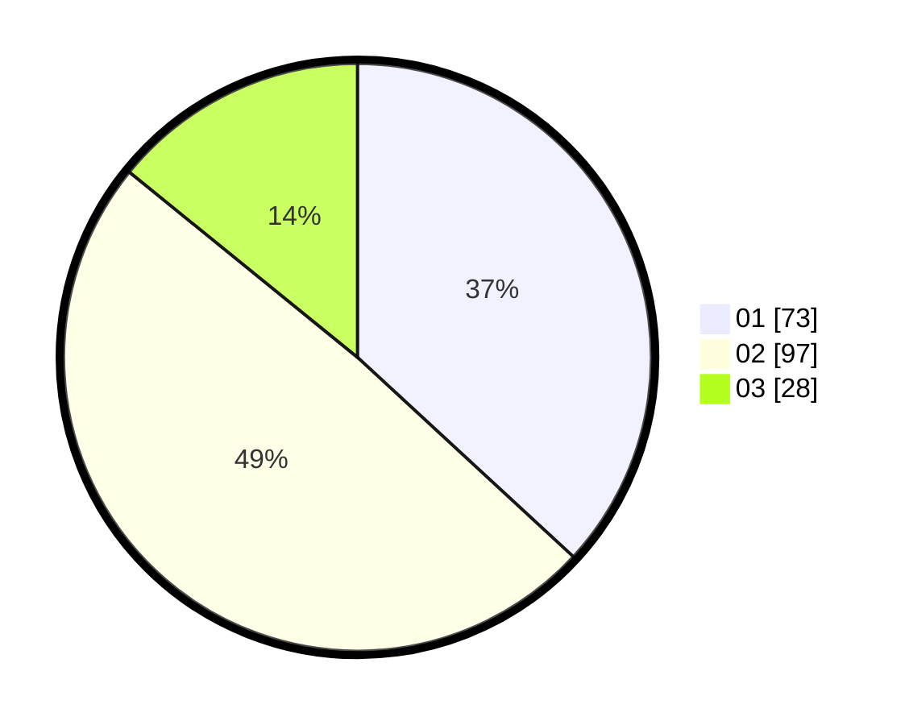

# Hasil

Hasil perolehan suara paslon dapat dilihat pada file paslon-01.txt, paslon-02.txt, dan paslon-03.txt.

Jika tidak ada, artinya data tersebut belum ada pada SIREKAP.

## Perolehan Suara

 * Paslon 01: **73**.
 * Paslon 02: **97**.
 * Paslon 03: **28**.

## Foto C Plano

https://sirekap-obj-formc.kpu.go.id/1001/pemilu/ppwp/31/73/01/10/01/3173011001119-20240215-014235--9e1131cb-be54-42f3-b307-4eca3d6aedf2.jpg

https://sirekap-obj-formc.kpu.go.id/1001/pemilu/ppwp/31/73/01/10/01/3173011001119-20240215-014353--a0b06714-dacc-4cc1-8d58-d268539cc7e3.jpg

https://sirekap-obj-formc.kpu.go.id/1001/pemilu/ppwp/31/73/01/10/01/3173011001119-20240215-014452--5641c812-124e-4601-a711-588e4b55597b.jpg
