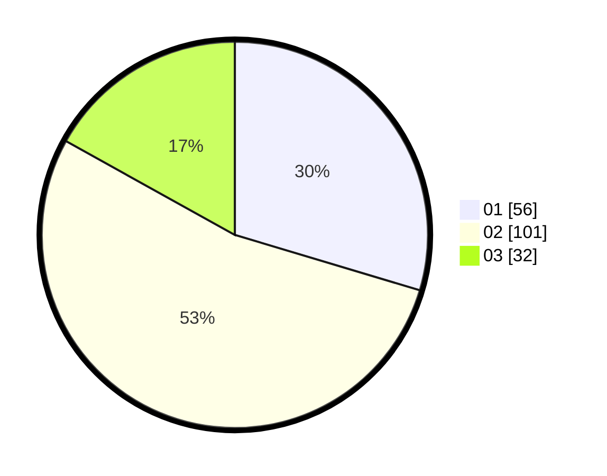

# Hasil

Hasil perolehan suara paslon dapat dilihat pada file paslon-01.txt, paslon-02.txt, dan paslon-03.txt.

Jika tidak ada, artinya data tersebut belum ada pada SIREKAP.

## Perolehan Suara

 * Paslon 01: **56**.
 * Paslon 02: **101**.
 * Paslon 03: **32**.

## Foto C Plano

https://sirekap-obj-formc.kpu.go.id/5642/pemilu/ppwp/31/73/01/10/01/3173011001121-20240214-205945--3b097622-88b2-40d1-8de6-956d8e1dd037.jpg

https://sirekap-obj-formc.kpu.go.id/5642/pemilu/ppwp/31/73/01/10/01/3173011001121-20240214-202956--057ee5ad-eb53-4c38-bc89-eddcd4ca79cc.jpg

https://sirekap-obj-formc.kpu.go.id/5642/pemilu/ppwp/31/73/01/10/01/3173011001121-20240216-093508--c08463ff-6cf5-46b7-9a4c-8c515aee5128.jpg

## DATA PEMILIH TETAP

Jumlah pemilih dalam DPT: **277**.
 * L: **138**.
 * P: **139**.

## DATA PENGGUNA HAK PILIH

Jumlah pengguna hak pilih dalam DPT: **193**.
 * L: **93**.
 * P: **100**.

Jumlah pengguna hak pilih dalam DPTb: **0**.
 * L: **0**.
 * P: **0**.

Jumlah pengguna hak pilih dalam DPK: **0**.
 * L: **0**.
 * P: **0**.

Jumlah pengguna hak pilih: **193**.
 * L: **93**.
 * P: **100**.

## JUMLAH SUARA SAH DAN TIDAK SAH

JUMLAH SELURUH SUARA SAH: **189**.

JUMLAH SUARA TIDAK SAH: **4**.

JUMLAH SELURUH SUARA SAH DAN SUARA TIDAK SAH: **193**.
