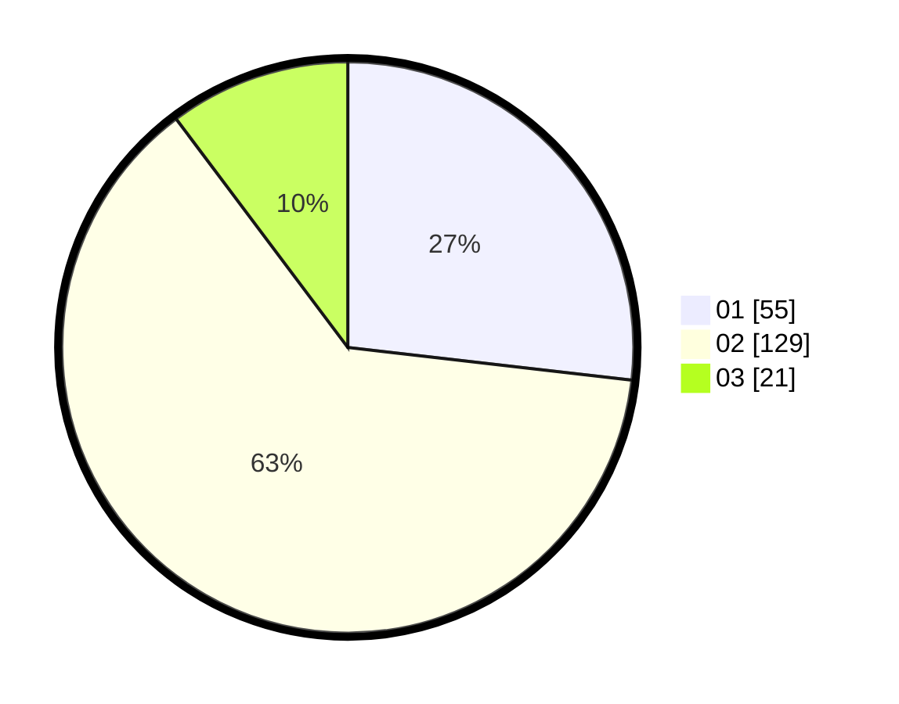

# Hasil

Hasil perolehan suara paslon dapat dilihat pada file paslon-01.txt, paslon-02.txt, dan paslon-03.txt.

Jika tidak ada, artinya data tersebut belum ada pada SIREKAP.

## Perolehan Suara

 * Paslon 01: **55**.
 * Paslon 02: **129**.
 * Paslon 03: **21**.

## Foto C Plano

https://sirekap-obj-formc.kpu.go.id/0a72/pemilu/ppwp/31/73/01/10/01/3173011001123-20240214-211150--bff87c11-be54-494b-a500-097cda016f46.jpg

https://sirekap-obj-formc.kpu.go.id/0a72/pemilu/ppwp/31/73/01/10/01/3173011001123-20240214-202032--890b1658-2333-4af1-97d4-996844b2256a.jpg

https://sirekap-obj-formc.kpu.go.id/0a72/pemilu/ppwp/31/73/01/10/01/3173011001123-20240214-202204--13d1bcee-5a78-41b3-a1f0-4f274701e220.jpg

## DATA PEMILIH TETAP

Jumlah pemilih dalam DPT: **278**.
 * L: **141**.
 * P: **137**.

## DATA PENGGUNA HAK PILIH

Jumlah pengguna hak pilih dalam DPT: **204**.
 * L: **97**.
 * P: **107**.

Jumlah pengguna hak pilih dalam DPTb: **0**.
 * L: **0**.
 * P: **0**.

Jumlah pengguna hak pilih dalam DPK: **4**.
 * L: **3**.
 * P: **1**.

Jumlah pengguna hak pilih: **208**.
 * L: **100**.
 * P: **108**.

## JUMLAH SUARA SAH DAN TIDAK SAH

JUMLAH SELURUH SUARA SAH: **205**.

JUMLAH SUARA TIDAK SAH: **3**.

JUMLAH SELURUH SUARA SAH DAN SUARA TIDAK SAH: **208**.
