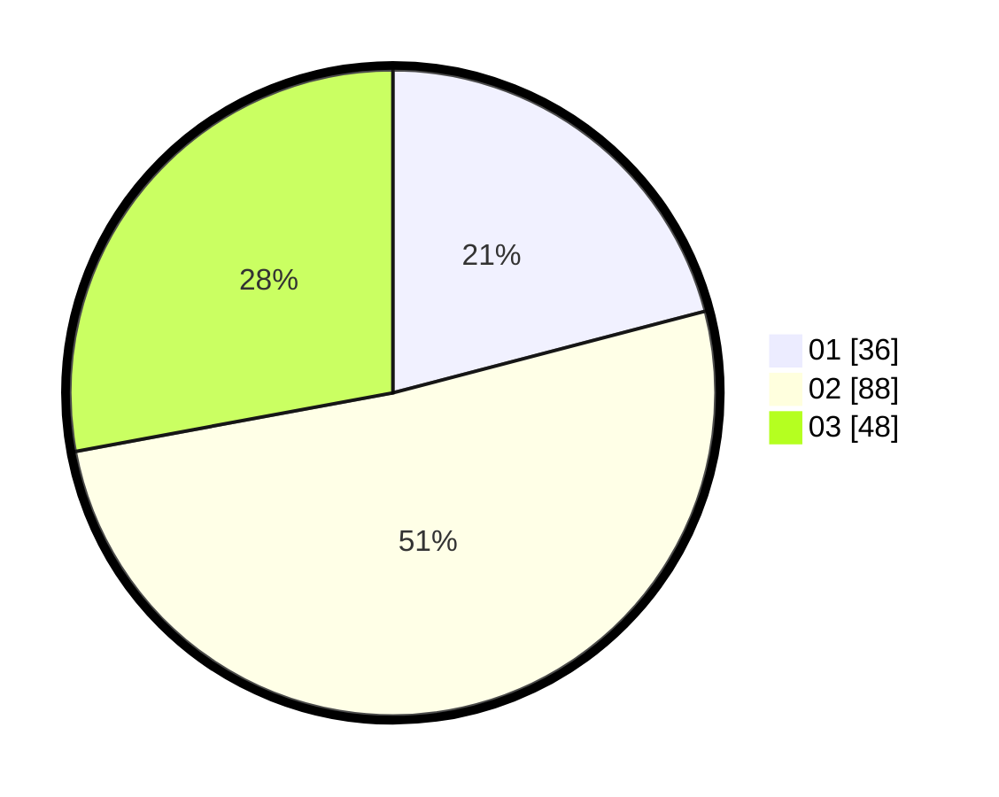

# Hasil

Hasil perolehan suara paslon dapat dilihat pada file paslon-01.txt, paslon-02.txt, dan paslon-03.txt.

Jika tidak ada, artinya data tersebut belum ada pada SIREKAP.

## Perolehan Suara

 * Paslon 01: **36**.
 * Paslon 02: **88**.
 * Paslon 03: **48**.

## Foto C Plano

https://sirekap-obj-formc.kpu.go.id/d039/pemilu/ppwp/31/73/01/10/01/3173011001126-20240214-212009--02299592-afc9-479b-8abb-14f6411114c4.jpg

https://sirekap-obj-formc.kpu.go.id/d039/pemilu/ppwp/31/73/01/10/01/3173011001126-20240214-214419--462133b6-8264-4c2f-8938-942304fa85a2.jpg

https://sirekap-obj-formc.kpu.go.id/d039/pemilu/ppwp/31/73/01/10/01/3173011001126-20240214-214205--a91bf28f-7b26-4ef5-ada7-527dc50e3411.jpg
