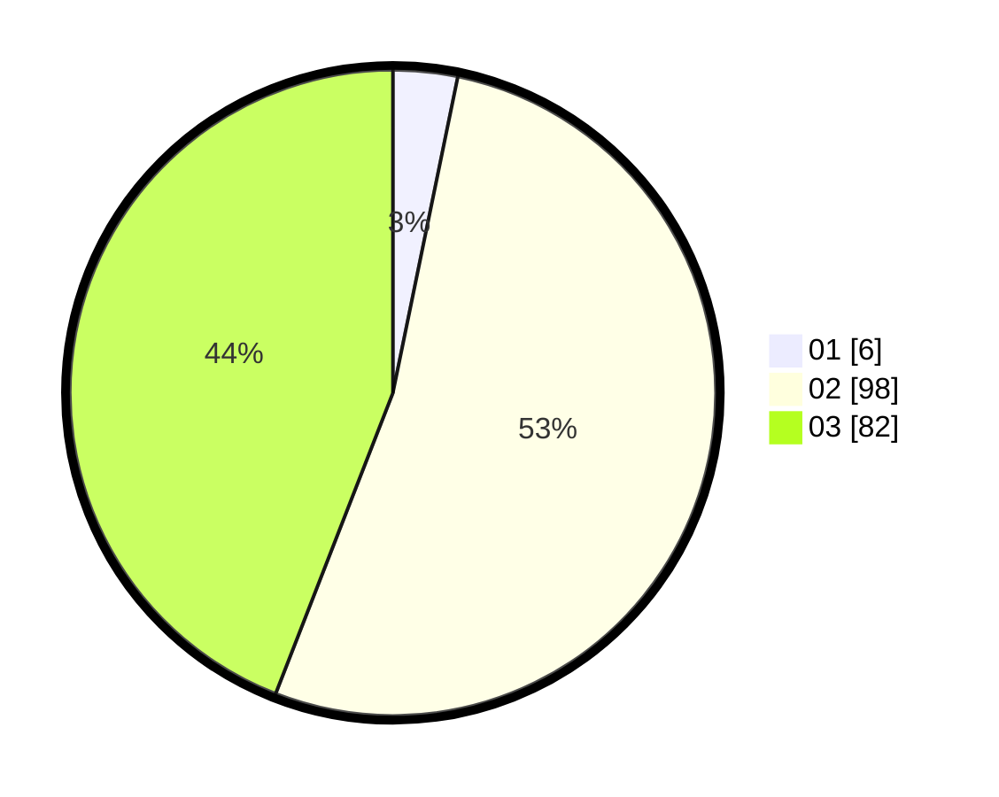

# Hasil

Hasil perolehan suara paslon dapat dilihat pada file paslon-01.txt, paslon-02.txt, dan paslon-03.txt.

Jika tidak ada, artinya data tersebut belum ada pada SIREKAP.

## Perolehan Suara

 * Paslon 01: **6**.
 * Paslon 02: **98**.
 * Paslon 03: **82**.

## Foto C Plano

https://sirekap-obj-formc.kpu.go.id/6592/pemilu/ppwp/31/73/01/10/01/3173011001129-20240214-155413--c086496e-b3f9-4747-a11b-ea94a5ff504d.jpg

https://sirekap-obj-formc.kpu.go.id/6592/pemilu/ppwp/31/73/01/10/01/3173011001129-20240214-155643--f62a9962-0042-46fc-8d15-187cfb4de88b.jpg

https://sirekap-obj-formc.kpu.go.id/6592/pemilu/ppwp/31/73/01/10/01/3173011001129-20240214-155724--4c820d9b-fc10-49c0-9516-f2551569e702.jpg

## DATA PEMILIH TETAP

Jumlah pemilih dalam DPT: **261**.
 * L: **138**.
 * P: **123**.

## DATA PENGGUNA HAK PILIH

Jumlah pengguna hak pilih dalam DPT: **173**.
 * L: **78**.
 * P: **95**.

Jumlah pengguna hak pilih dalam DPTb: **14**.
 * L: **8**.
 * P: **6**.

Jumlah pengguna hak pilih dalam DPK: **0**.
 * L: **0**.
 * P: **0**.

Jumlah pengguna hak pilih: **187**.
 * L: **86**.
 * P: **101**.

## JUMLAH SUARA SAH DAN TIDAK SAH

JUMLAH SELURUH SUARA SAH: **186**.

JUMLAH SUARA TIDAK SAH: **1**.

JUMLAH SELURUH SUARA SAH DAN SUARA TIDAK SAH: **187**.
