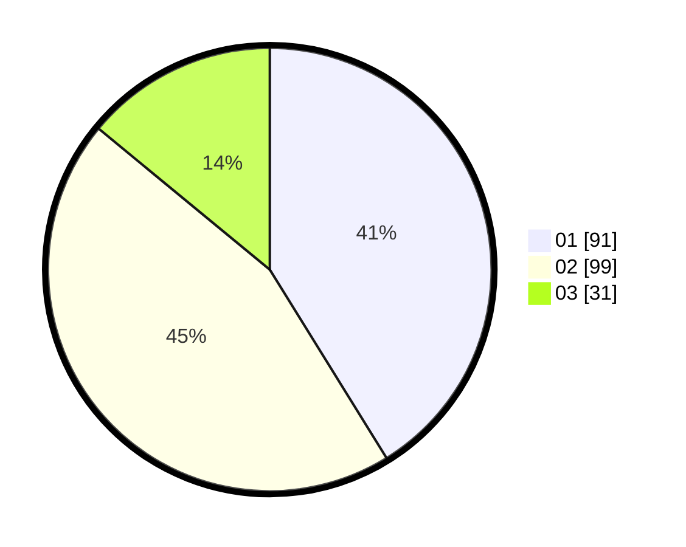

# Hasil

Hasil perolehan suara paslon dapat dilihat pada file paslon-01.txt, paslon-02.txt, dan paslon-03.txt.

Jika tidak ada, artinya data tersebut belum ada pada SIREKAP.

## Perolehan Suara

 * Paslon 01: **91**.
 * Paslon 02: **99**.
 * Paslon 03: **31**.

## Foto C Plano

https://sirekap-obj-formc.kpu.go.id/fcb1/pemilu/ppwp/31/73/01/10/01/3173011001132-20240214-230526--e98c3c13-9dde-4a76-9a52-b0531d80a469.jpg

https://sirekap-obj-formc.kpu.go.id/fcb1/pemilu/ppwp/31/73/01/10/01/3173011001132-20240214-230535--b9ea2b68-e761-4026-8760-b55573a0e15b.jpg

https://sirekap-obj-formc.kpu.go.id/fcb1/pemilu/ppwp/31/73/01/10/01/3173011001132-20240214-230546--30f5ff3e-8465-47df-9369-6dbfb3f2d449.jpg
