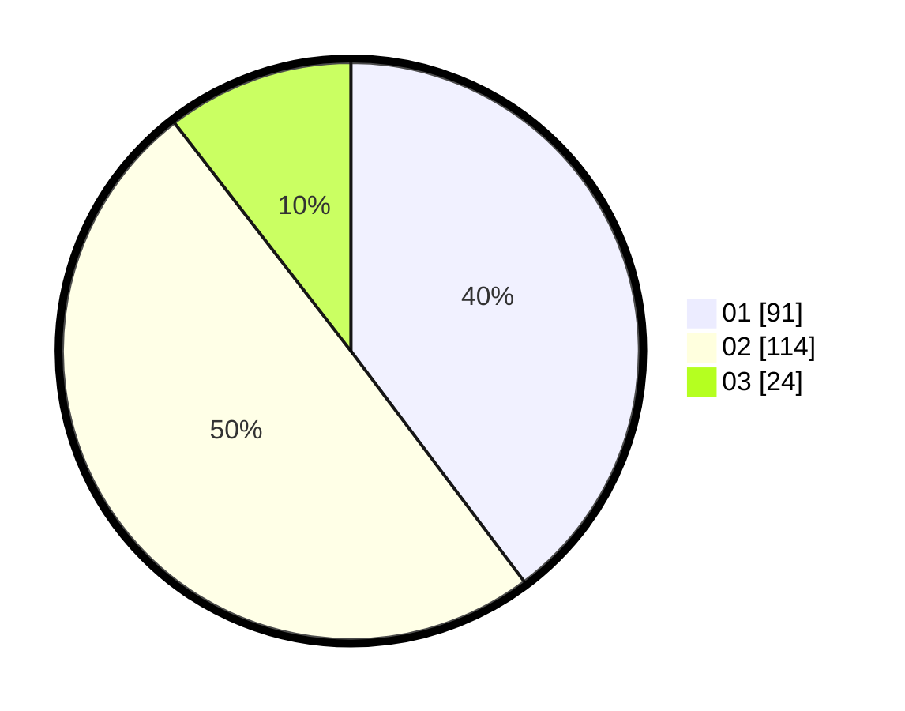

# Hasil

Hasil perolehan suara paslon dapat dilihat pada file paslon-01.txt, paslon-02.txt, dan paslon-03.txt.

Jika tidak ada, artinya data tersebut belum ada pada SIREKAP.

## Perolehan Suara

 * Paslon 01: **91**.
 * Paslon 02: **114**.
 * Paslon 03: **24**.

## Foto C Plano

https://sirekap-obj-formc.kpu.go.id/304b/pemilu/ppwp/31/73/01/10/01/3173011001133-20240215-010558--63beb3ee-bef9-4533-b681-602ced8ea979.jpg

https://sirekap-obj-formc.kpu.go.id/304b/pemilu/ppwp/31/73/01/10/01/3173011001133-20240215-010649--43b7475a-c257-40d8-9908-3a2e666f7e01.jpg

https://sirekap-obj-formc.kpu.go.id/304b/pemilu/ppwp/31/73/01/10/01/3173011001133-20240215-010730--e3db8062-17aa-440d-9f88-5ed0ff3d84ac.jpg
