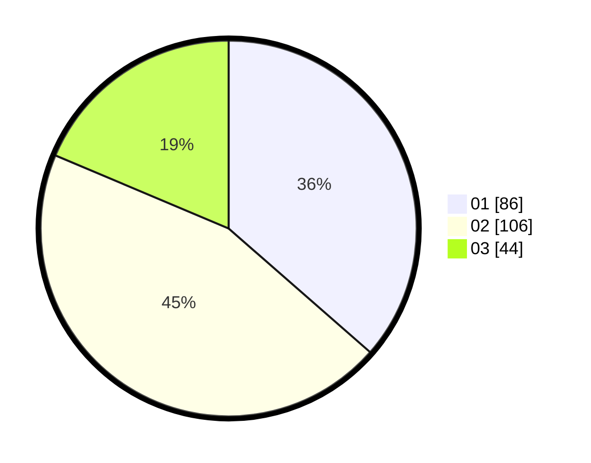

# Hasil

Hasil perolehan suara paslon dapat dilihat pada file paslon-01.txt, paslon-02.txt, dan paslon-03.txt.

Jika tidak ada, artinya data tersebut belum ada pada SIREKAP.

## Perolehan Suara

 * Paslon 01: **86**.
 * Paslon 02: **106**.
 * Paslon 03: **44**.

## Foto C Plano

https://sirekap-obj-formc.kpu.go.id/b0cc/pemilu/ppwp/31/73/01/10/01/3173011001137-20240215-011318--89a463de-de2c-42d3-b98e-f1420666435c.jpg

https://sirekap-obj-formc.kpu.go.id/b0cc/pemilu/ppwp/31/73/01/10/01/3173011001137-20240215-011129--34a22b78-12a1-4d8c-9d68-448b51c8561a.jpg

https://sirekap-obj-formc.kpu.go.id/b0cc/pemilu/ppwp/31/73/01/10/01/3173011001137-20240215-011230--de817ed7-8d1c-46da-abfc-22b3305f5560.jpg
