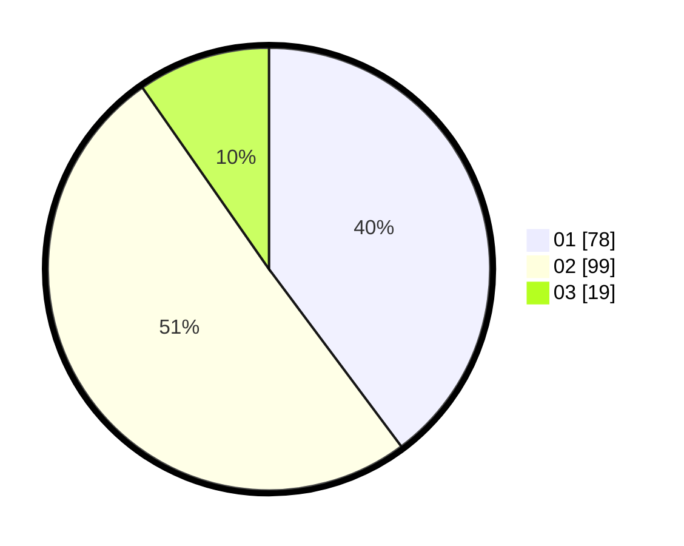

# Hasil

Hasil perolehan suara paslon dapat dilihat pada file paslon-01.txt, paslon-02.txt, dan paslon-03.txt.

Jika tidak ada, artinya data tersebut belum ada pada SIREKAP.

## Perolehan Suara

 * Paslon 01: **78**.
 * Paslon 02: **99**.
 * Paslon 03: **19**.

## Foto C Plano

https://sirekap-obj-formc.kpu.go.id/cb2c/pemilu/ppwp/31/73/01/10/01/3173011001144-20240216-065314--bf54bf29-059e-4b0e-b5d4-21cf0b96b89c.jpg

https://sirekap-obj-formc.kpu.go.id/cb2c/pemilu/ppwp/31/73/01/10/01/3173011001144-20240216-065315--f25047c0-7f42-49a4-be1b-d0472bb86d17.jpg

https://sirekap-obj-formc.kpu.go.id/cb2c/pemilu/ppwp/31/73/01/10/01/3173011001144-20240216-065315--f9b9ee10-9b73-480f-afea-7aedd10790b4.jpg

## DATA PEMILIH TETAP

Jumlah pemilih dalam DPT: **198**.
 * L: **93**.
 * P: **105**.

## DATA PENGGUNA HAK PILIH

Jumlah pengguna hak pilih dalam DPT: **198**.
 * L: **93**.
 * P: **105**.

Jumlah pengguna hak pilih dalam DPTb: **1**.
 * L: **1**.
 * P: **0**.

Jumlah pengguna hak pilih dalam DPK: **0**.
 * L: **0**.
 * P: **0**.

Jumlah pengguna hak pilih: **199**.
 * L: **94**.
 * P: **105**.

## JUMLAH SUARA SAH DAN TIDAK SAH

JUMLAH SELURUH SUARA SAH: **196**.

JUMLAH SUARA TIDAK SAH: **3**.

JUMLAH SELURUH SUARA SAH DAN SUARA TIDAK SAH: **199**.
