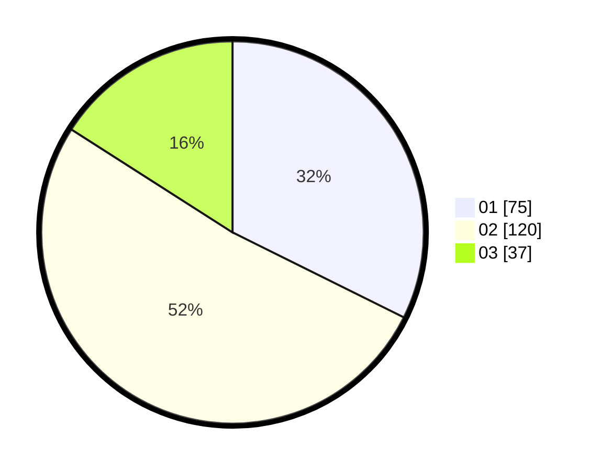

# Hasil

Hasil perolehan suara paslon dapat dilihat pada file paslon-01.txt, paslon-02.txt, dan paslon-03.txt.

Jika tidak ada, artinya data tersebut belum ada pada SIREKAP.

## Perolehan Suara

 * Paslon 01: **75**.
 * Paslon 02: **120**.
 * Paslon 03: **37**.

## Foto C Plano

https://sirekap-obj-formc.kpu.go.id/20f5/pemilu/ppwp/31/73/01/10/01/3173011001146-20240214-234145--69795bb1-3c4e-4ccb-b333-245acb2841f4.jpg

https://sirekap-obj-formc.kpu.go.id/20f5/pemilu/ppwp/31/73/01/10/01/3173011001146-20240214-234206--9d082e60-3d56-447c-b278-38d8dfb40058.jpg

https://sirekap-obj-formc.kpu.go.id/20f5/pemilu/ppwp/31/73/01/10/01/3173011001146-20240214-234211--a958643d-9650-428e-8243-06cae5bd1a59.jpg
