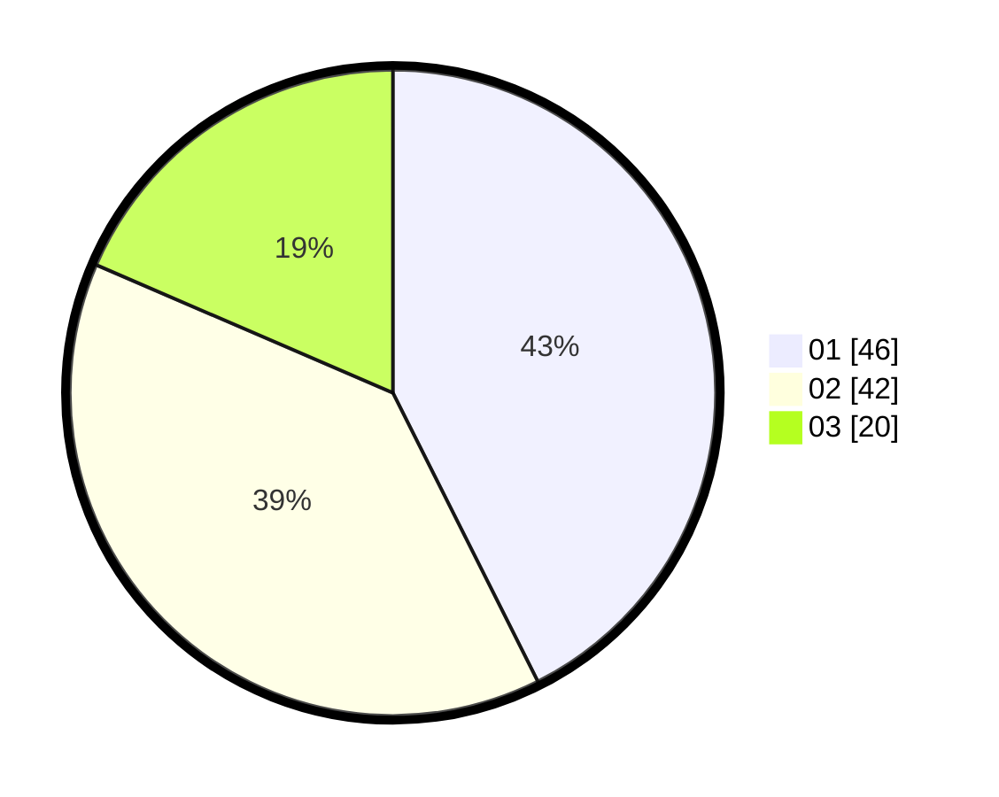

# Hasil

Hasil perolehan suara paslon dapat dilihat pada file paslon-01.txt, paslon-02.txt, dan paslon-03.txt.

Jika tidak ada, artinya data tersebut belum ada pada SIREKAP.

## Perolehan Suara

 * Paslon 01: **46**.
 * Paslon 02: **42**.
 * Paslon 03: **20**.

## Foto C Plano

https://sirekap-obj-formc.kpu.go.id/ffee/pemilu/ppwp/31/73/01/10/01/3173011001148-20240215-160727--4b1e94f1-f753-4326-9494-472a5b4f07c1.jpg

https://sirekap-obj-formc.kpu.go.id/ffee/pemilu/ppwp/31/73/01/10/01/3173011001148-20240214-225605--d9c5e740-dcee-452b-9dee-947c10b10663.jpg

https://sirekap-obj-formc.kpu.go.id/ffee/pemilu/ppwp/31/73/01/10/01/3173011001148-20240214-225611--c3ef7ec4-ff36-4668-8e75-e8537bc69d37.jpg
