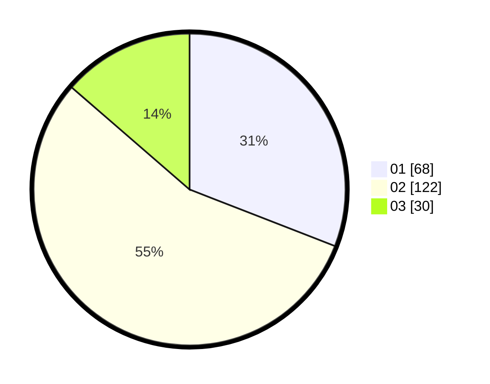

# Hasil

Hasil perolehan suara paslon dapat dilihat pada file paslon-01.txt, paslon-02.txt, dan paslon-03.txt.

Jika tidak ada, artinya data tersebut belum ada pada SIREKAP.

## Perolehan Suara

 * Paslon 01: **68**.
 * Paslon 02: **122**.
 * Paslon 03: **30**.

## Foto C Plano

https://sirekap-obj-formc.kpu.go.id/6225/pemilu/ppwp/31/73/01/10/01/3173011001151-20240214-234927--b2f7293e-2bce-4e14-879d-c97df23d8ce6.jpg

https://sirekap-obj-formc.kpu.go.id/6225/pemilu/ppwp/31/73/01/10/01/3173011001151-20240214-235124--58445f3c-39ba-47ef-b998-38b65ece88e8.jpg

https://sirekap-obj-formc.kpu.go.id/6225/pemilu/ppwp/31/73/01/10/01/3173011001151-20240214-235315--01b64935-8280-4480-833d-08495ebbbe96.jpg
