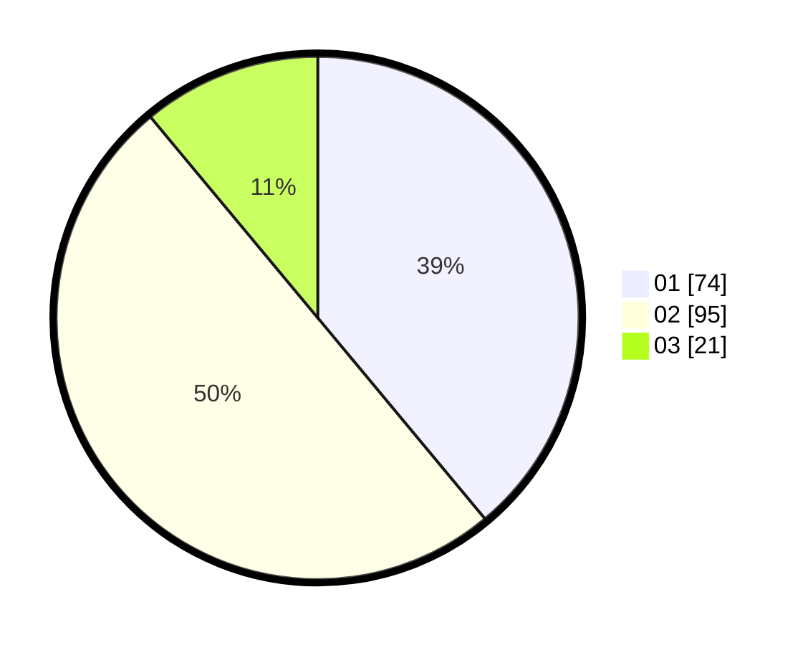

# Hasil

Hasil perolehan suara paslon dapat dilihat pada file paslon-01.txt, paslon-02.txt, dan paslon-03.txt.

Jika tidak ada, artinya data tersebut belum ada pada SIREKAP.

## Perolehan Suara

 * Paslon 01: **74**.
 * Paslon 02: **95**.
 * Paslon 03: **21**.

## Foto C Plano

https://sirekap-obj-formc.kpu.go.id/573e/pemilu/ppwp/31/73/01/10/01/3173011001154-20240214-155901--4192bd7b-5b8d-401f-828f-9c3460bca6a5.jpg

https://sirekap-obj-formc.kpu.go.id/573e/pemilu/ppwp/31/73/01/10/01/3173011001154-20240214-155919--50ff44a2-f538-486c-a24e-5865a972b4f6.jpg

https://sirekap-obj-formc.kpu.go.id/573e/pemilu/ppwp/31/73/01/10/01/3173011001154-20240214-155924--3210705b-cb1c-4bb0-9cf8-438035b12d19.jpg

## DATA PEMILIH TETAP

Jumlah pemilih dalam DPT: **261**.
 * L: **144**.
 * P: **117**.

## DATA PENGGUNA HAK PILIH

Jumlah pengguna hak pilih dalam DPT: **194**.
 * L: **106**.
 * P: **88**.

Jumlah pengguna hak pilih dalam DPTb: **0**.
 * L: **0**.
 * P: **0**.

Jumlah pengguna hak pilih dalam DPK: **0**.
 * L: **0**.
 * P: **0**.

Jumlah pengguna hak pilih: **194**.
 * L: **106**.
 * P: **88**.

## JUMLAH SUARA SAH DAN TIDAK SAH

JUMLAH SELURUH SUARA SAH: **190**.

JUMLAH SUARA TIDAK SAH: **4**.

JUMLAH SELURUH SUARA SAH DAN SUARA TIDAK SAH: **194**.
