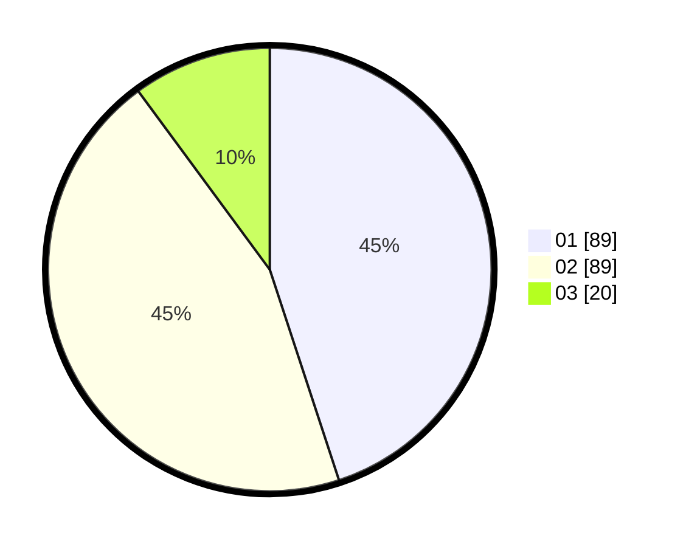

# Hasil

Hasil perolehan suara paslon dapat dilihat pada file paslon-01.txt, paslon-02.txt, dan paslon-03.txt.

Jika tidak ada, artinya data tersebut belum ada pada SIREKAP.

## Perolehan Suara

 * Paslon 01: **89**.
 * Paslon 02: **89**.
 * Paslon 03: **20**.

## Foto C Plano

https://sirekap-obj-formc.kpu.go.id/efb7/pemilu/ppwp/31/73/01/10/01/3173011001155-20240215-003354--9802db05-b1a8-46ae-841c-d4a5d370bfd7.jpg

https://sirekap-obj-formc.kpu.go.id/efb7/pemilu/ppwp/31/73/01/10/01/3173011001155-20240215-003505--d37e2f29-3ca2-4dca-966d-85104e903119.jpg

https://sirekap-obj-formc.kpu.go.id/efb7/pemilu/ppwp/31/73/01/10/01/3173011001155-20240215-002630--7d9f677a-c968-4d6b-bf12-318283a206f2.jpg
