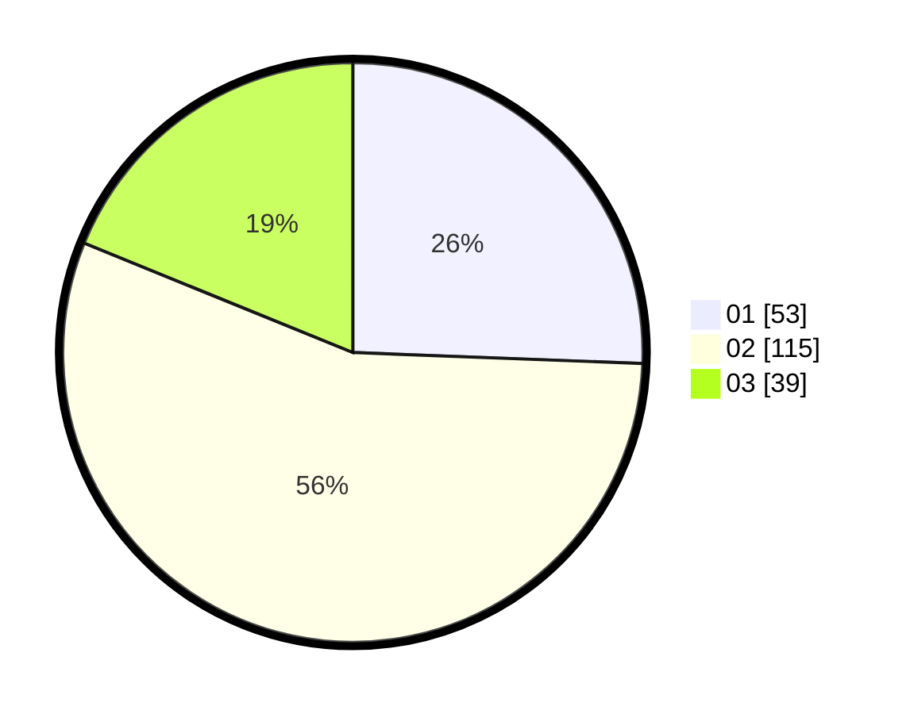

# Hasil

Hasil perolehan suara paslon dapat dilihat pada file paslon-01.txt, paslon-02.txt, dan paslon-03.txt.

Jika tidak ada, artinya data tersebut belum ada pada SIREKAP.

## Perolehan Suara

 * Paslon 01: **53**.
 * Paslon 02: **115**.
 * Paslon 03: **39**.

## Foto C Plano

https://sirekap-obj-formc.kpu.go.id/a7c3/pemilu/ppwp/31/73/01/10/01/3173011001156-20240214-223932--9856dfcf-a541-4dc8-b50e-234f39bcebe0.jpg

https://sirekap-obj-formc.kpu.go.id/a7c3/pemilu/ppwp/31/73/01/10/01/3173011001156-20240215-063811--c87e427c-c466-4d33-a929-831c11ce77ca.jpg

https://sirekap-obj-formc.kpu.go.id/a7c3/pemilu/ppwp/31/73/01/10/01/3173011001156-20240214-224055--1173bd96-df26-4837-83fc-5e271403e3eb.jpg
