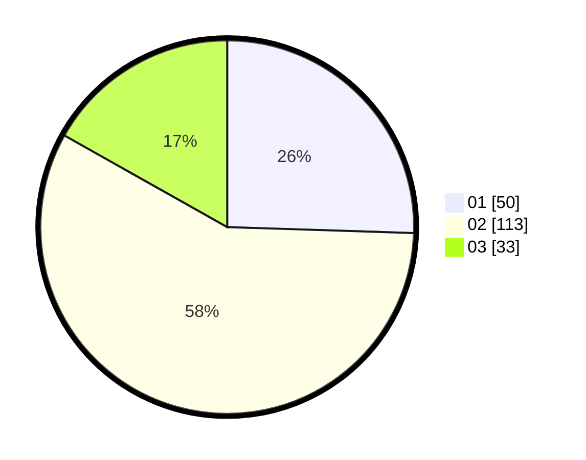

# Hasil

Hasil perolehan suara paslon dapat dilihat pada file paslon-01.txt, paslon-02.txt, dan paslon-03.txt.

Jika tidak ada, artinya data tersebut belum ada pada SIREKAP.

## Perolehan Suara

 * Paslon 01: **50**.
 * Paslon 02: **113**.
 * Paslon 03: **33**.

## Foto C Plano

https://sirekap-obj-formc.kpu.go.id/2922/pemilu/ppwp/31/73/01/10/01/3173011001158-20240215-001612--52fc97b9-020e-4627-839e-8be06bd2ca22.jpg

https://sirekap-obj-formc.kpu.go.id/2922/pemilu/ppwp/31/73/01/10/01/3173011001158-20240215-001732--e3d02acc-de3e-4b2b-8967-acb6def682a9.jpg

https://sirekap-obj-formc.kpu.go.id/2922/pemilu/ppwp/31/73/01/10/01/3173011001158-20240215-001900--7500f7ae-ff0a-416d-b3b5-43cfd594aed7.jpg

## DATA PEMILIH TETAP

Jumlah pemilih dalam DPT: **251**.
 * L: **122**.
 * P: **129**.

## DATA PENGGUNA HAK PILIH

Jumlah pengguna hak pilih dalam DPT: **200**.
 * L: **93**.
 * P: **107**.

Jumlah pengguna hak pilih dalam DPTb: **1**.
 * L: **1**.
 * P: **0**.

Jumlah pengguna hak pilih dalam DPK: **1**.
 * L: **0**.
 * P: **1**.

Jumlah pengguna hak pilih: **202**.
 * L: **94**.
 * P: **108**.

## JUMLAH SUARA SAH DAN TIDAK SAH

JUMLAH SELURUH SUARA SAH: **196**.

JUMLAH SUARA TIDAK SAH: **6**.

JUMLAH SELURUH SUARA SAH DAN SUARA TIDAK SAH: **202**.
