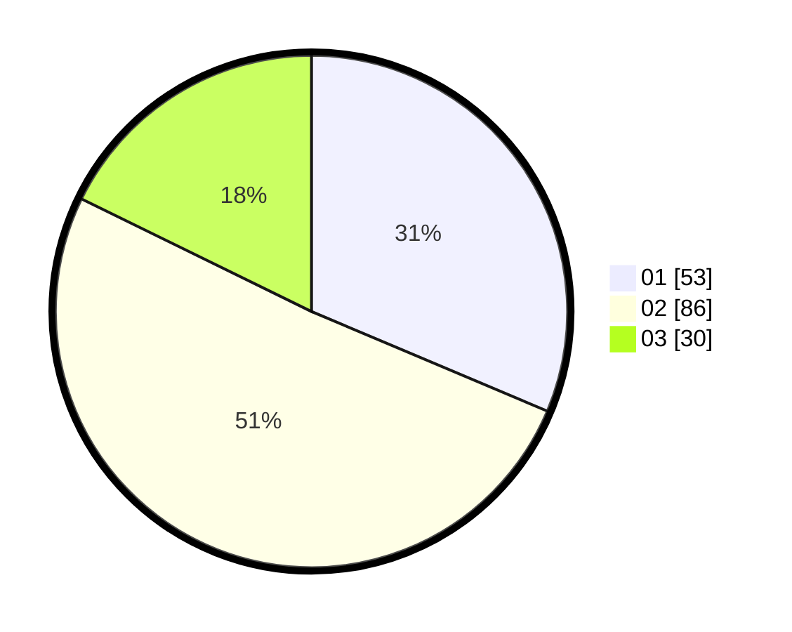

# Hasil

Hasil perolehan suara paslon dapat dilihat pada file paslon-01.txt, paslon-02.txt, dan paslon-03.txt.

Jika tidak ada, artinya data tersebut belum ada pada SIREKAP.

## Perolehan Suara

 * Paslon 01: **53**.
 * Paslon 02: **86**.
 * Paslon 03: **30**.

## Foto C Plano

https://sirekap-obj-formc.kpu.go.id/9fa6/pemilu/ppwp/31/73/01/10/01/3173011001159-20240214-210305--5e1ff0d5-0a1e-45cb-95f3-f90e331e8a5b.jpg

https://sirekap-obj-formc.kpu.go.id/9fa6/pemilu/ppwp/31/73/01/10/01/3173011001159-20240214-210512--3813bbb8-efa8-4596-bc49-09094b47022a.jpg

https://sirekap-obj-formc.kpu.go.id/9fa6/pemilu/ppwp/31/73/01/10/01/3173011001159-20240215-151943--992370b9-460b-415e-848f-7e3848095316.jpg

## DATA PEMILIH TETAP

Jumlah pemilih dalam DPT: **179**.
 * L: **93**.
 * P: **86**.

## DATA PENGGUNA HAK PILIH

Jumlah pengguna hak pilih dalam DPT: **179**.
 * L: **93**.
 * P: **86**.

Jumlah pengguna hak pilih dalam DPTb: **0**.
 * L: **0**.
 * P: **0**.

Jumlah pengguna hak pilih dalam DPK: **0**.
 * L: **0**.
 * P: **0**.

Jumlah pengguna hak pilih: **179**.
 * L: **93**.
 * P: **86**.

## JUMLAH SUARA SAH DAN TIDAK SAH

JUMLAH SELURUH SUARA SAH: **169**.

JUMLAH SUARA TIDAK SAH: **11**.

JUMLAH SELURUH SUARA SAH DAN SUARA TIDAK SAH: **180**.
