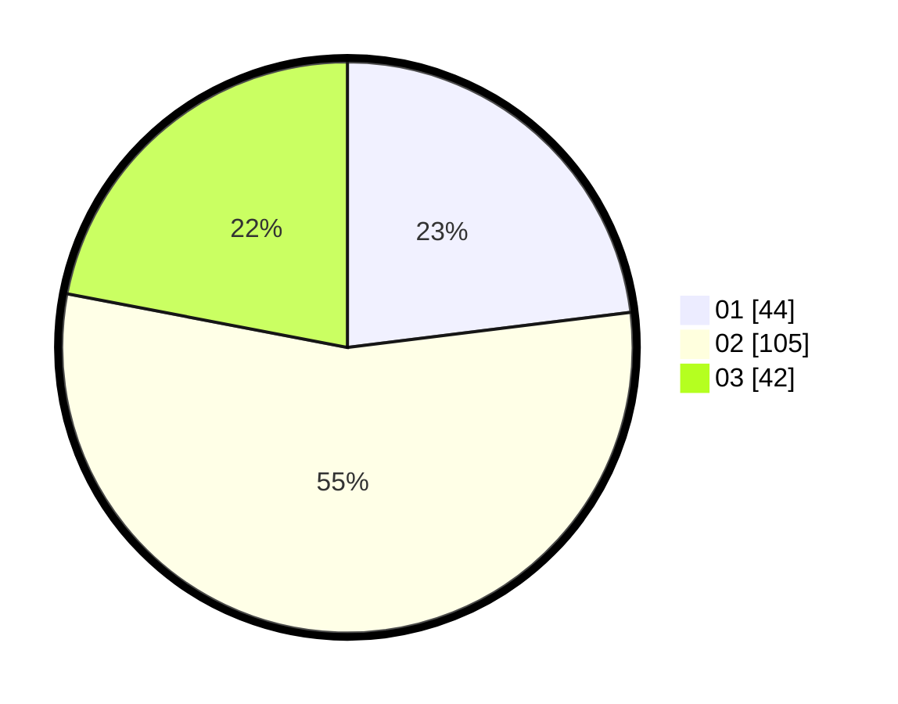

# Hasil

Hasil perolehan suara paslon dapat dilihat pada file paslon-01.txt, paslon-02.txt, dan paslon-03.txt.

Jika tidak ada, artinya data tersebut belum ada pada SIREKAP.

## Perolehan Suara

 * Paslon 01: **44**.
 * Paslon 02: **105**.
 * Paslon 03: **42**.

## Foto C Plano

https://sirekap-obj-formc.kpu.go.id/f9fd/pemilu/ppwp/31/73/01/10/01/3173011001160-20240215-023413--1a2616ea-318c-4396-b731-dc580c4cb603.jpg

https://sirekap-obj-formc.kpu.go.id/f9fd/pemilu/ppwp/31/73/01/10/01/3173011001160-20240214-223122--72d17c75-6016-4fae-8855-7c62b3462c88.jpg

https://sirekap-obj-formc.kpu.go.id/f9fd/pemilu/ppwp/31/73/01/10/01/3173011001160-20240214-223236--600c1f06-a28e-46f1-a4e3-ceac94f66ba0.jpg
