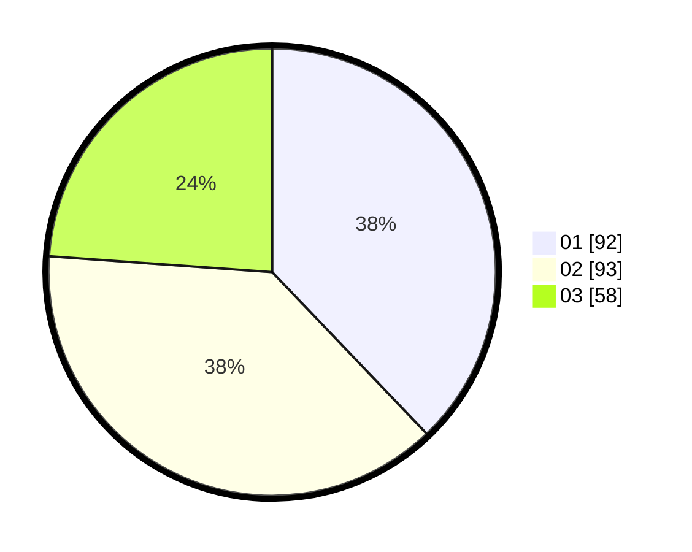

# Hasil

Hasil perolehan suara paslon dapat dilihat pada file paslon-01.txt, paslon-02.txt, dan paslon-03.txt.

Jika tidak ada, artinya data tersebut belum ada pada SIREKAP.

## Perolehan Suara

 * Paslon 01: **92**.
 * Paslon 02: **93**.
 * Paslon 03: **58**.

## Foto C Plano

https://sirekap-obj-formc.kpu.go.id/b60e/pemilu/ppwp/31/73/01/10/01/3173011001161-20240214-211714--d14c8dc1-a4bb-4ac4-863e-65a4e7b6c62a.jpg

https://sirekap-obj-formc.kpu.go.id/b60e/pemilu/ppwp/31/73/01/10/01/3173011001161-20240214-211802--b8a7046d-0360-4834-8a18-68ca8e757bbb.jpg

https://sirekap-obj-formc.kpu.go.id/b60e/pemilu/ppwp/31/73/01/10/01/3173011001161-20240214-211843--4edecc58-18ab-410f-83a1-5449530f49f2.jpg

## DATA PEMILIH TETAP

Jumlah pemilih dalam DPT: **281**.
 * L: **151**.
 * P: **130**.

## DATA PENGGUNA HAK PILIH

Jumlah pengguna hak pilih dalam DPT: **244**.
 * L: **127**.
 * P: **117**.

Jumlah pengguna hak pilih dalam DPTb: **2**.
 * L: **2**.
 * P: **0**.

Jumlah pengguna hak pilih dalam DPK: **5**.
 * L: **2**.
 * P: **3**.

Jumlah pengguna hak pilih: **251**.
 * L: **131**.
 * P: **120**.

## JUMLAH SUARA SAH DAN TIDAK SAH

JUMLAH SELURUH SUARA SAH: **243**.

JUMLAH SUARA TIDAK SAH: **4**.

JUMLAH SELURUH SUARA SAH DAN SUARA TIDAK SAH: **251**.
