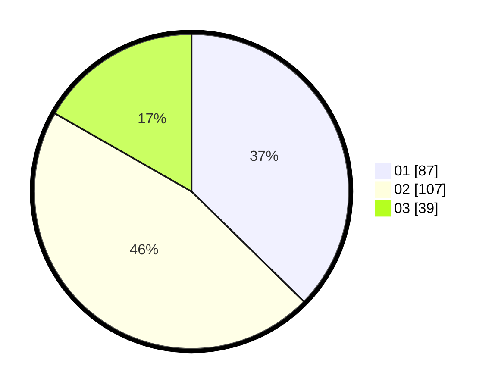

# Hasil

Hasil perolehan suara paslon dapat dilihat pada file paslon-01.txt, paslon-02.txt, dan paslon-03.txt.

Jika tidak ada, artinya data tersebut belum ada pada SIREKAP.

## Perolehan Suara

 * Paslon 01: **87**.
 * Paslon 02: **107**.
 * Paslon 03: **39**.

## Foto C Plano

https://sirekap-obj-formc.kpu.go.id/05a1/pemilu/ppwp/31/73/01/10/01/3173011001162-20240215-022239--bd140115-2f71-42b8-b729-cfce2375c85f.jpg

https://sirekap-obj-formc.kpu.go.id/05a1/pemilu/ppwp/31/73/01/10/01/3173011001162-20240215-010004--4d0420fb-c100-4a3e-8bc9-1a91a015ebf7.jpg

https://sirekap-obj-formc.kpu.go.id/05a1/pemilu/ppwp/31/73/01/10/01/3173011001162-20240215-005944--5bb33baa-3837-4a07-8f3d-685e5c1df48f.jpg
