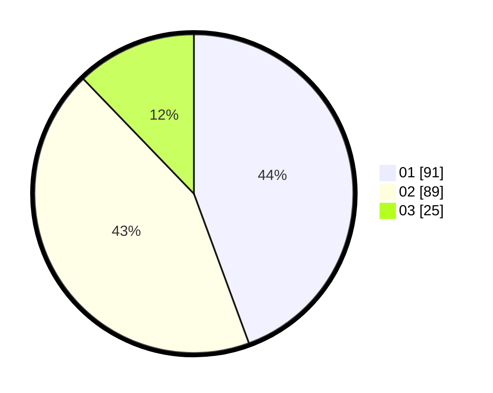

# Hasil

Hasil perolehan suara paslon dapat dilihat pada file paslon-01.txt, paslon-02.txt, dan paslon-03.txt.

Jika tidak ada, artinya data tersebut belum ada pada SIREKAP.

## Perolehan Suara

 * Paslon 01: **91**.
 * Paslon 02: **89**.
 * Paslon 03: **25**.

## Foto C Plano

https://sirekap-obj-formc.kpu.go.id/82f3/pemilu/ppwp/31/73/01/10/01/3173011001163-20240214-222708--dd966c05-152b-478a-a66d-65c3c17d8a49.jpg

https://sirekap-obj-formc.kpu.go.id/82f3/pemilu/ppwp/31/73/01/10/01/3173011001163-20240214-222745--1860c44e-e7a5-4103-ad62-9a31171d8d20.jpg

https://sirekap-obj-formc.kpu.go.id/82f3/pemilu/ppwp/31/73/01/10/01/3173011001163-20240214-222826--503dac06-3c9a-4e31-9e7a-793eab02de24.jpg
