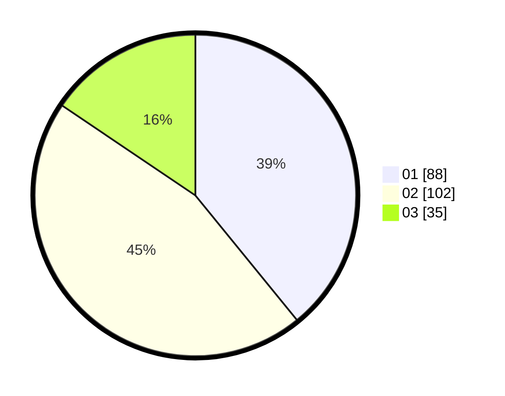

# Hasil

Hasil perolehan suara paslon dapat dilihat pada file paslon-01.txt, paslon-02.txt, dan paslon-03.txt.

Jika tidak ada, artinya data tersebut belum ada pada SIREKAP.

## Perolehan Suara

 * Paslon 01: **88**.
 * Paslon 02: **102**.
 * Paslon 03: **35**.

## Foto C Plano

https://sirekap-obj-formc.kpu.go.id/bcc5/pemilu/ppwp/31/73/01/10/01/3173011001170-20240214-202017--f3e5a8ff-3b91-45f9-9d57-c0b7ccd91855.jpg

https://sirekap-obj-formc.kpu.go.id/bcc5/pemilu/ppwp/31/73/01/10/01/3173011001170-20240214-194758--80c02dce-6e0a-4270-9fb7-b1b73f1afb5f.jpg

https://sirekap-obj-formc.kpu.go.id/bcc5/pemilu/ppwp/31/73/01/10/01/3173011001170-20240214-201648--7ff0f1ac-bd2d-4169-9fa6-350d36879d76.jpg

## DATA PEMILIH TETAP

Jumlah pemilih dalam DPT: **269**.
 * L: **135**.
 * P: **134**.

## DATA PENGGUNA HAK PILIH

Jumlah pengguna hak pilih dalam DPT: **225**.
 * L: **108**.
 * P: **117**.

Jumlah pengguna hak pilih dalam DPTb: **0**.
 * L: **0**.
 * P: **0**.

Jumlah pengguna hak pilih dalam DPK: **1**.
 * L: **1**.
 * P: **0**.

Jumlah pengguna hak pilih: **226**.
 * L: **109**.
 * P: **117**.

## JUMLAH SUARA SAH DAN TIDAK SAH

JUMLAH SELURUH SUARA SAH: **225**.

JUMLAH SUARA TIDAK SAH: **1**.

JUMLAH SELURUH SUARA SAH DAN SUARA TIDAK SAH: **226**.
